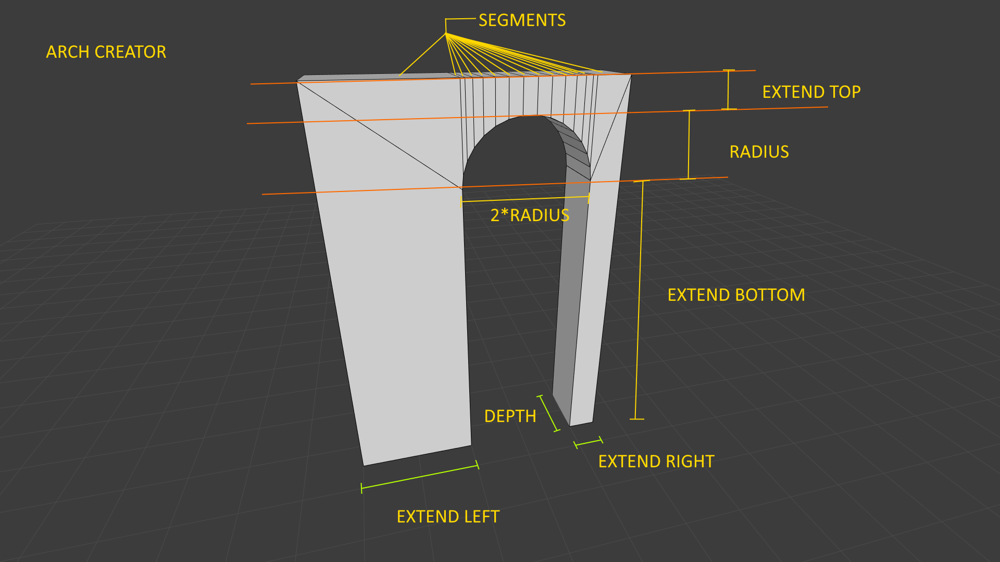
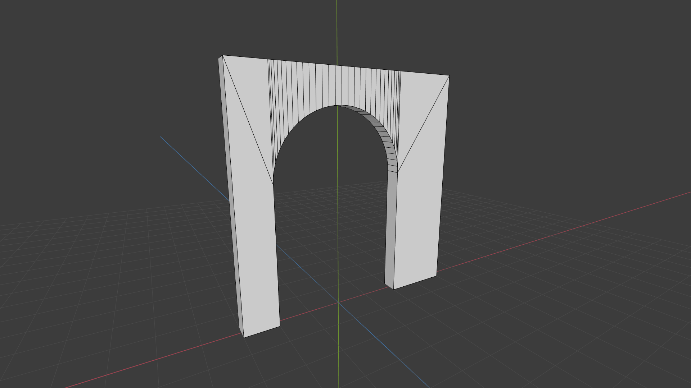

# Asset Creators

### ArchCreator



**Example**

```java
Mesh3D mesh;
ArchCreator creator = new ArchCreator();
creator.setSegments(32);
creator.setRadius(2);
creator.setExtendTop(1);
creator.setExtendBottom(4);
creator.setExtendLeft(1);
creator.setExtendRight(2);
creator.setDepth(0.5f);
mesh = creator.create();

````

