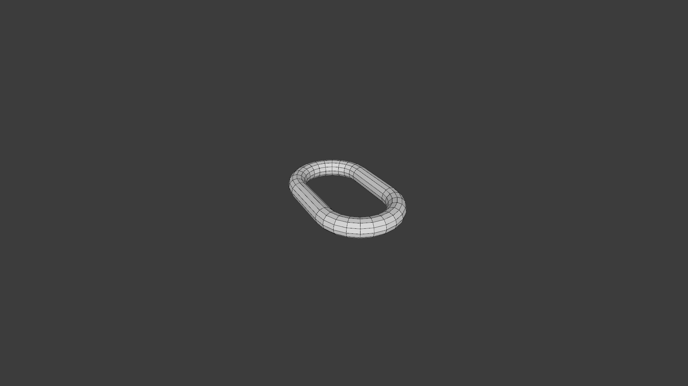
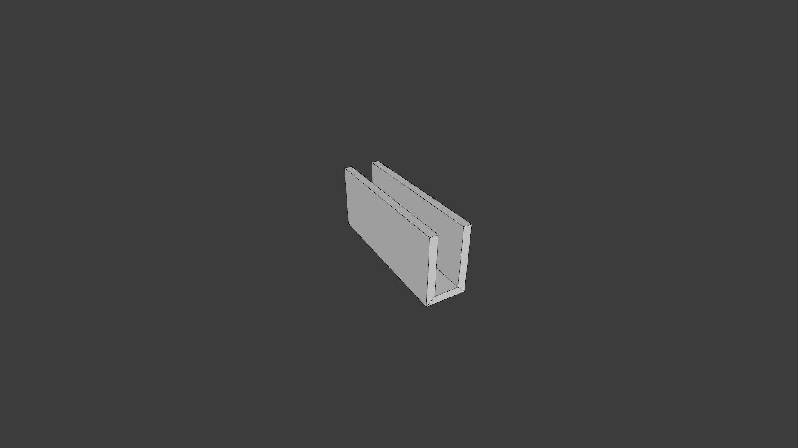
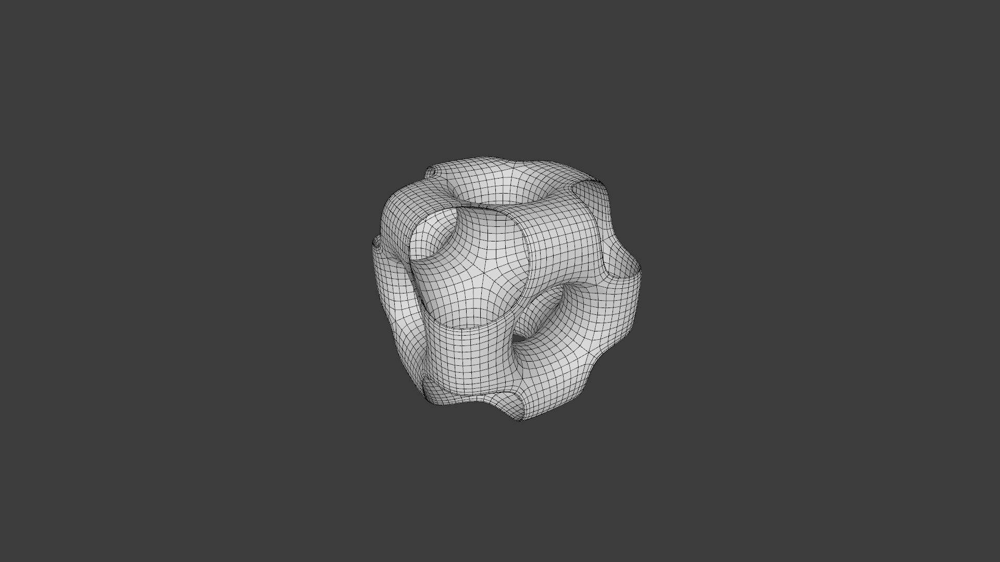

# Creators

In the meantime 100+ creators are available.

# CuboctahedronCreator


**Name:** CuboctahedronCreator

**Category:** archimedian

**Parameters:** 

NONE

**Usage:**

```java
import mesh.Mesh3D
import mesh.creator.archimedian.CuboctahedronCreator;

CuboctahedronCreator creator = new CuboctahedronCreator();
Mesh3D mesh = creator.create();
```

# IcosidodecahedronCreator


**Name:** IcosidodecahedronCreator

**Category:** archimedian

**Parameters:** 

NONE

**Usage:**

```java
import mesh.Mesh3D
import mesh.creator.archimedian.IcosidodecahedronCreator;

IcosidodecahedronCreator creator = new IcosidodecahedronCreator();
Mesh3D mesh = creator.create();
```

# RhombicosidodecahedronCreator


**Name:** RhombicosidodecahedronCreator

**Category:** archimedian

**Parameters:** 

NONE

**Usage:**

```java
import mesh.Mesh3D
import mesh.creator.archimedian.RhombicosidodecahedronCreator;

RhombicosidodecahedronCreator creator = new RhombicosidodecahedronCreator();
Mesh3D mesh = creator.create();
```

# RhombicuboctahedronCreator


**Name:** RhombicuboctahedronCreator

**Category:** archimedian

**Parameters:** 

NONE

**Usage:**

```java
import mesh.Mesh3D
import mesh.creator.archimedian.RhombicuboctahedronCreator;

RhombicuboctahedronCreator creator = new RhombicuboctahedronCreator();
Mesh3D mesh = creator.create();
```

# SnubCubeCreator


**Name:** SnubCubeCreator

**Category:** archimedian

**Parameters:** 

NONE

**Usage:**

```java
import mesh.Mesh3D
import mesh.creator.archimedian.SnubCubeCreator;

SnubCubeCreator creator = new SnubCubeCreator();
Mesh3D mesh = creator.create();
```

# SnubDodecahedronCreator


**Name:** SnubDodecahedronCreator

**Category:** archimedian

**Parameters:** 

NONE

**Usage:**

```java
import mesh.Mesh3D
import mesh.creator.archimedian.SnubDodecahedronCreator;

SnubDodecahedronCreator creator = new SnubDodecahedronCreator();
Mesh3D mesh = creator.create();
```

# TruncatedCubeCreator


**Name:** TruncatedCubeCreator

**Category:** archimedian

**Parameters:** 

NONE

**Usage:**

```java
import mesh.Mesh3D
import mesh.creator.archimedian.TruncatedCubeCreator;

TruncatedCubeCreator creator = new TruncatedCubeCreator();
Mesh3D mesh = creator.create();
```

# TruncatedCuboctahedronCreator


**Name:** TruncatedCuboctahedronCreator

**Category:** archimedian

**Parameters:** 

NONE

**Usage:**

```java
import mesh.Mesh3D
import mesh.creator.archimedian.TruncatedCuboctahedronCreator;

TruncatedCuboctahedronCreator creator = new TruncatedCuboctahedronCreator();
Mesh3D mesh = creator.create();
```

# TruncatedDodecahedronCreator


**Name:** TruncatedDodecahedronCreator

**Category:** archimedian

**Parameters:** 

NONE

**Usage:**

```java
import mesh.Mesh3D
import mesh.creator.archimedian.TruncatedDodecahedronCreator;

TruncatedDodecahedronCreator creator = new TruncatedDodecahedronCreator();
Mesh3D mesh = creator.create();
```

# TruncatedIcosahedronCreator


**Name:** TruncatedIcosahedronCreator

**Category:** archimedian

**Parameters:** 

NONE

**Usage:**

```java
import mesh.Mesh3D
import mesh.creator.archimedian.TruncatedIcosahedronCreator;

TruncatedIcosahedronCreator creator = new TruncatedIcosahedronCreator();
Mesh3D mesh = creator.create();
```

# TruncatedIcosidodecahedronCreator


**Name:** TruncatedIcosidodecahedronCreator

**Category:** archimedian

**Parameters:** 

NONE

**Usage:**

```java
import mesh.Mesh3D
import mesh.creator.archimedian.TruncatedIcosidodecahedronCreator;

TruncatedIcosidodecahedronCreator creator = new TruncatedIcosidodecahedronCreator();
Mesh3D mesh = creator.create();
```

# TruncatedOctahedronCreator


**Name:** TruncatedOctahedronCreator

**Category:** archimedian

**Parameters:** 

NONE

**Usage:**

```java
import mesh.Mesh3D
import mesh.creator.archimedian.TruncatedOctahedronCreator;

TruncatedOctahedronCreator creator = new TruncatedOctahedronCreator();
Mesh3D mesh = creator.create();
```

# TruncatedTetrahedronCreator


**Name:** TruncatedTetrahedronCreator

**Category:** archimedian

**Parameters:** 

NONE

**Usage:**

```java
import mesh.Mesh3D
import mesh.creator.archimedian.TruncatedTetrahedronCreator;

TruncatedTetrahedronCreator creator = new TruncatedTetrahedronCreator();
Mesh3D mesh = creator.create();
```

# ArchCreator


**Name:** ArchCreator

**Category:** assets

**Parameters:** 

*  **ExtendTop**
*  **Segments**
*  **ExtendBottom**
*  **ExtendLeft**
*  **ExtendRight**
*  **Radius**
*  **Depth**


**Usage:**

```java
import mesh.Mesh3D
import mesh.creator.assets.ArchCreator;

ArchCreator creator = new ArchCreator();
Mesh3D mesh = creator.create();
```

# ArchDoorCreator


**Name:** ArchDoorCreator

**Category:** assets

**Parameters:** 

*  **Segments**
*  **ExtendBottom**
*  **Radius**
*  **Depth**


**Usage:**

```java
import mesh.Mesh3D
import mesh.creator.assets.ArchDoorCreator;

ArchDoorCreator creator = new ArchDoorCreator();
Mesh3D mesh = creator.create();
```

# BridgeCreator


**Name:** BridgeCreator

**Category:** assets

**Parameters:** 

NONE

**Usage:**

```java
import mesh.Mesh3D
import mesh.creator.assets.BridgeCreator;

BridgeCreator creator = new BridgeCreator();
Mesh3D mesh = creator.create();
```

# CentralStringerStaircaseCreator


**Name:** CentralStringerStaircaseCreator

**Category:** assets

**Parameters:** 

*  **RailingRotationSegments**
*  **StepsCount**
*  **Height**


**Usage:**

```java
import mesh.Mesh3D
import mesh.creator.assets.CentralStringerStaircaseCreator;

CentralStringerStaircaseCreator creator = new CentralStringerStaircaseCreator();
Mesh3D mesh = creator.create();
```

# ChainLinkCreator



**Name:** ChainLinkCreator

**Category:** assets

**Parameters:** 

*  **MajorSegments**
*  **MinorRadius**
*  **CenterPieceSize**
*  **MajorRadius**
*  **MinorSegments**


**Usage:**

```java
import mesh.Mesh3D
import mesh.creator.assets.ChainLinkCreator;

ChainLinkCreator creator = new ChainLinkCreator();
Mesh3D mesh = creator.create();
```

# CircularRailingCreator


**Name:** CircularRailingCreator

**Category:** assets

**Parameters:** 

NONE

**Usage:**

```java
import mesh.Mesh3D
import mesh.creator.assets.CircularRailingCreator;

CircularRailingCreator creator = new CircularRailingCreator();
Mesh3D mesh = creator.create();
```

# CrateCreator


**Name:** CrateCreator

**Category:** assets

**Parameters:** 

*  **CroosBeamType**
*  **InsetDepth**
*  **Radius**
*  **Inset**


**Usage:**

```java
import mesh.Mesh3D
import mesh.creator.assets.CrateCreator;

CrateCreator creator = new CrateCreator();
Mesh3D mesh = creator.create();
```

# CubedPillarCreator


**Name:** CubedPillarCreator

**Category:** assets

**Parameters:** 

*  **SegmentRadius**
*  **SegmentCount**
*  **Extrude**


**Usage:**

```java
import mesh.Mesh3D
import mesh.creator.assets.CubedPillarCreator;

CubedPillarCreator creator = new CubedPillarCreator();
Mesh3D mesh = creator.create();
```

# DresserCreator


**Name:** DresserCreator

**Category:** assets

**Parameters:** 

*  **DrawerRows**
*  **DrawerCols**
*  **PanelThickness**
*  **Depth**
*  **Width**
*  **Height**


**Usage:**

```java
import mesh.Mesh3D
import mesh.creator.assets.DresserCreator;

DresserCreator creator = new DresserCreator();
Mesh3D mesh = creator.create();
```

# FlangePipeCreator


**Name:** FlangePipeCreator

**Category:** assets

**Parameters:** 

*  **RotationSegments**
*  **FlangeOuterRadius**
*  **PipeSegmentLength**
*  **BoltHeadPercantage**
*  **FlangeGrooveWidth**
*  **SegmentCount**
*  **FlangeDepth**
*  **PipeRadius**
*  **BoltCount**
*  **BoltCapFillType**
*  **BoltHeadHeight**


**Usage:**

```java
import mesh.Mesh3D
import mesh.creator.assets.FlangePipeCreator;

FlangePipeCreator creator = new FlangePipeCreator();
Mesh3D mesh = creator.create();
```

# FloorPatternCreator


**Name:** FloorPatternCreator

**Category:** assets

**Parameters:** 

*  **Subdivisions**
*  **Radius**
*  **Height**


**Usage:**

```java
import mesh.Mesh3D
import mesh.creator.assets.FloorPatternCreator;

FloorPatternCreator creator = new FloorPatternCreator();
Mesh3D mesh = creator.create();
```

# FloorPatternNoiseCreator


**Name:** FloorPatternNoiseCreator

**Category:** assets

**Parameters:** 

*  **Subdivisions**
*  **Radius**
*  **Height**


**Usage:**

```java
import mesh.Mesh3D
import mesh.creator.assets.FloorPatternNoiseCreator;

FloorPatternNoiseCreator creator = new FloorPatternNoiseCreator();
Mesh3D mesh = creator.create();
```

# GearCreator


**Name:** GearCreator

**Category:** assets

**Parameters:** 

*  **NumberOfTeeth**
*  **Radius**
*  **Width**
*  **Base**


**Usage:**

```java
import mesh.Mesh3D
import mesh.creator.assets.GearCreator;

GearCreator creator = new GearCreator();
Mesh3D mesh = creator.create();
```

# MedievalTowerRoundCreator


**Name:** MedievalTowerRoundCreator

**Category:** assets

**Parameters:** 

*  **RotationSegments**
*  **CapFillType**
*  **FloorSegments**
*  **Radius**
*  **FloorSegmentHeight**


**Usage:**

```java
import mesh.Mesh3D
import mesh.creator.assets.MedievalTowerRoundCreator;

MedievalTowerRoundCreator creator = new MedievalTowerRoundCreator();
Mesh3D mesh = creator.create();
```

# MFloorCeiling


**Name:** MFloorCeiling

**Category:** modular

**Parameters:** 

NONE

**Usage:**

```java
import mesh.Mesh3D
import mesh.creator.assets.modular.MFloorCeiling;

MFloorCeiling creator = new MFloorCeiling();
Mesh3D mesh = creator.create();
```

# ModularKitWall


**Name:** ModularKitWall

**Category:** modular

**Parameters:** 

NONE

**Usage:**

```java
import mesh.Mesh3D
import mesh.creator.assets.modular.ModularKitWall;

ModularKitWall creator = new ModularKitWall();
Mesh3D mesh = creator.create();
```

# ModularKitDoorSegmentCreator


**Name:** ModularKitDoorSegmentCreator

**Category:** assets

**Parameters:** 

*  **DoorHeight**
*  **SegmentWidth**
*  **SegmentDepth**
*  **DoorWidth**
*  **SegmentHeight**


**Usage:**

```java
import mesh.Mesh3D
import mesh.creator.assets.ModularKitDoorSegmentCreator;

ModularKitDoorSegmentCreator creator = new ModularKitDoorSegmentCreator();
Mesh3D mesh = creator.create();
```

# ModularKitFloorSegmentCreator


**Name:** ModularKitFloorSegmentCreator

**Category:** assets

**Parameters:** 

*  **FloorDepth**
*  **FloorHeight**
*  **FloorWidth**


**Usage:**

```java
import mesh.Mesh3D
import mesh.creator.assets.ModularKitFloorSegmentCreator;

ModularKitFloorSegmentCreator creator = new ModularKitFloorSegmentCreator();
Mesh3D mesh = creator.create();
```

# PillarCreator


**Name:** PillarCreator

**Category:** assets

**Parameters:** 

*  **RotationSegments**
*  **CapFillType**
*  **TopSegments**
*  **BottomSegments**
*  **CenterHeight**
*  **BottomHeight**
*  **TopHeight**
*  **Radius**


**Usage:**

```java
import mesh.Mesh3D
import mesh.creator.assets.PillarCreator;

PillarCreator creator = new PillarCreator();
Mesh3D mesh = creator.create();
```

# PitchedRoofCreator


**Name:** PitchedRoofCreator

**Category:** assets

**Parameters:** 

*  **Triangulate**
*  **SnapToGround**
*  **CapBottom**
*  **Depth**
*  **Width**
*  **Height**


**Usage:**

```java
import mesh.Mesh3D
import mesh.creator.assets.PitchedRoofCreator;

PitchedRoofCreator creator = new PitchedRoofCreator();
Mesh3D mesh = creator.create();
```

# ProfileWallCreator


**Name:** ProfileWallCreator

**Category:** assets

**Parameters:** 

*  **Corner**
*  **Width**


**Usage:**

```java
import mesh.Mesh3D
import mesh.creator.assets.ProfileWallCreator;

ProfileWallCreator creator = new ProfileWallCreator();
Mesh3D mesh = creator.create();
```

# SciFiFloorCreator


**Name:** SciFiFloorCreator

**Category:** assets

**Parameters:** 

NONE

**Usage:**

```java
import mesh.Mesh3D
import mesh.creator.assets.SciFiFloorCreator;

SciFiFloorCreator creator = new SciFiFloorCreator();
Mesh3D mesh = creator.create();
```

# SciFiFloorSupportCreator


**Name:** SciFiFloorSupportCreator

**Category:** assets

**Parameters:** 

*  **CapBottom**
*  **ExtendBack**
*  **ExtendFront**
*  **MirrorGap**
*  **SupportCount**
*  **ExtendTop**
*  **Segments**
*  **ExtendBottom**
*  **Radius**
*  **Width**
*  **CapBack**
*  **Gap**
*  **CapTop**
*  **Mirror**


**Usage:**

```java
import mesh.Mesh3D
import mesh.creator.assets.SciFiFloorSupportCreator;

SciFiFloorSupportCreator creator = new SciFiFloorSupportCreator();
Mesh3D mesh = creator.create();
```

# SciFiPlatformCreator


**Name:** SciFiPlatformCreator

**Category:** assets

**Parameters:** 

NONE

**Usage:**

```java
import mesh.Mesh3D
import mesh.creator.assets.SciFiPlatformCreator;

SciFiPlatformCreator creator = new SciFiPlatformCreator();
Mesh3D mesh = creator.create();
```

# SimpleCrateCreator


**Name:** SimpleCrateCreator

**Category:** assets

**Parameters:** 

*  **ExtrudeAmount**
*  **Inset**


**Usage:**

```java
import mesh.Mesh3D
import mesh.creator.assets.SimpleCrateCreator;

SimpleCrateCreator creator = new SimpleCrateCreator();
Mesh3D mesh = creator.create();
```

# SimpleSciFiCrateCreator


**Name:** SimpleSciFiCrateCreator

**Category:** assets

**Parameters:** 

*  **ExtrudeAmount**
*  **ExtrudeScale**


**Usage:**

```java
import mesh.Mesh3D
import mesh.creator.assets.SimpleSciFiCrateCreator;

SimpleSciFiCrateCreator creator = new SimpleSciFiCrateCreator();
Mesh3D mesh = creator.create();
```

# StairsCreator


**Name:** StairsCreator

**Category:** assets

**Parameters:** 

*  **StepDepth**
*  **StepHeight**
*  **Floating**
*  **NumSteps**
*  **Width**


**Usage:**

```java
import mesh.Mesh3D
import mesh.creator.assets.StairsCreator;

StairsCreator creator = new StairsCreator();
Mesh3D mesh = creator.create();
```

# WallSegmentCreator


**Name:** WallSegmentCreator

**Category:** assets

**Parameters:** 

NONE

**Usage:**

```java
import mesh.Mesh3D
import mesh.creator.assets.WallSegmentCreator;

WallSegmentCreator creator = new WallSegmentCreator();
Mesh3D mesh = creator.create();
```

# WoodenBarrelCreator


**Name:** WoodenBarrelCreator

**Category:** assets

**Parameters:** 

*  **RotationSegments**
*  **BendFactor**
*  **HeightSegments**
*  **Radius**
*  **Height**
*  **Inset**


**Usage:**

```java
import mesh.Mesh3D
import mesh.creator.assets.WoodenBarrelCreator;

WoodenBarrelCreator creator = new WoodenBarrelCreator();
Mesh3D mesh = creator.create();
```

# BeamCProfileCreator


**Name:** BeamCProfileCreator

**Category:** beam

**Parameters:** 

*  **Thickness**
*  **Depth**
*  **Width**
*  **Height**
*  **Taper**


**Usage:**

```java
import mesh.Mesh3D
import mesh.creator.beam.BeamCProfileCreator;

BeamCProfileCreator creator = new BeamCProfileCreator();
Mesh3D mesh = creator.create();
```

# BeamCreator


**Name:** BeamCreator

**Category:** beam

**Parameters:** 

*  **Type**
*  **Thickness**
*  **Depth**
*  **Width**
*  **Height**
*  **Taper**


**Usage:**

```java
import mesh.Mesh3D
import mesh.creator.beam.BeamCreator;

BeamCreator creator = new BeamCreator();
Mesh3D mesh = creator.create();
```

# BeamIProfileCreator


**Name:** BeamIProfileCreator

**Category:** beam

**Parameters:** 

*  **Thickness**
*  **Depth**
*  **Width**
*  **Height**
*  **Taper**


**Usage:**

```java
import mesh.Mesh3D
import mesh.creator.beam.BeamIProfileCreator;

BeamIProfileCreator creator = new BeamIProfileCreator();
Mesh3D mesh = creator.create();
```

# BeamLProfileCreator


**Name:** BeamLProfileCreator

**Category:** beam

**Parameters:** 

*  **Thickness**
*  **Depth**
*  **Width**
*  **Height**
*  **Taper**


**Usage:**

```java
import mesh.Mesh3D
import mesh.creator.beam.BeamLProfileCreator;

BeamLProfileCreator creator = new BeamLProfileCreator();
Mesh3D mesh = creator.create();
```

# BeamOProfileCreator


**Name:** BeamOProfileCreator

**Category:** beam

**Parameters:** 

*  **Thickness**
*  **Depth**
*  **Width**
*  **Height**
*  **Taper**


**Usage:**

```java
import mesh.Mesh3D
import mesh.creator.beam.BeamOProfileCreator;

BeamOProfileCreator creator = new BeamOProfileCreator();
Mesh3D mesh = creator.create();
```

# BeamTProfileCreator


**Name:** BeamTProfileCreator

**Category:** beam

**Parameters:** 

*  **Thickness**
*  **Depth**
*  **Width**
*  **Height**
*  **Taper**


**Usage:**

```java
import mesh.Mesh3D
import mesh.creator.beam.BeamTProfileCreator;

BeamTProfileCreator creator = new BeamTProfileCreator();
Mesh3D mesh = creator.create();
```

# BeamUProfileCreator



**Name:** BeamUProfileCreator

**Category:** beam

**Parameters:** 

*  **Thickness**
*  **Depth**
*  **Width**
*  **Height**
*  **Taper**


**Usage:**

```java
import mesh.Mesh3D
import mesh.creator.beam.BeamUProfileCreator;

BeamUProfileCreator creator = new BeamUProfileCreator();
Mesh3D mesh = creator.create();
```

# DeltoidalIcositetrahedronCreator


**Name:** DeltoidalIcositetrahedronCreator

**Category:** catalan

**Parameters:** 

NONE

**Usage:**

```java
import mesh.Mesh3D
import mesh.creator.catalan.DeltoidalIcositetrahedronCreator;

DeltoidalIcositetrahedronCreator creator = new DeltoidalIcositetrahedronCreator();
Mesh3D mesh = creator.create();
```

# PentakisDodecahedronCreator


**Name:** PentakisDodecahedronCreator

**Category:** catalan

**Parameters:** 

NONE

**Usage:**

```java
import mesh.Mesh3D
import mesh.creator.catalan.PentakisDodecahedronCreator;

PentakisDodecahedronCreator creator = new PentakisDodecahedronCreator();
Mesh3D mesh = creator.create();
```

# RhombicDodecahedronCreator


**Name:** RhombicDodecahedronCreator

**Category:** catalan

**Parameters:** 

NONE

**Usage:**

```java
import mesh.Mesh3D
import mesh.creator.catalan.RhombicDodecahedronCreator;

RhombicDodecahedronCreator creator = new RhombicDodecahedronCreator();
Mesh3D mesh = creator.create();
```

# TetrakisHexahedronCreator


**Name:** TetrakisHexahedronCreator

**Category:** catalan

**Parameters:** 

NONE

**Usage:**

```java
import mesh.Mesh3D
import mesh.creator.catalan.TetrakisHexahedronCreator;

TetrakisHexahedronCreator creator = new TetrakisHexahedronCreator();
Mesh3D mesh = creator.create();
```

# TriakisOctahedronCreator


**Name:** TriakisOctahedronCreator

**Category:** catalan

**Parameters:** 

NONE

**Usage:**

```java
import mesh.Mesh3D
import mesh.creator.catalan.TriakisOctahedronCreator;

TriakisOctahedronCreator creator = new TriakisOctahedronCreator();
Mesh3D mesh = creator.create();
```

# TriakisTetrahedronCreator


**Name:** TriakisTetrahedronCreator

**Category:** catalan

**Parameters:** 

NONE

**Usage:**

```java
import mesh.Mesh3D
import mesh.creator.catalan.TriakisTetrahedronCreator;

TriakisTetrahedronCreator creator = new TriakisTetrahedronCreator();
Mesh3D mesh = creator.create();
```

# CubicLatticeCreator


**Name:** CubicLatticeCreator

**Category:** creative

**Parameters:** 

*  **Subdivisions**
*  **SegmentsX**
*  **SegmentsY**
*  **SegmentsZ**


**Usage:**

```java
import mesh.Mesh3D
import mesh.creator.creative.CubicLatticeCreator;

CubicLatticeCreator creator = new CubicLatticeCreator();
Mesh3D mesh = creator.create();
```

# LeonardoCubeCreator


**Name:** LeonardoCubeCreator

**Category:** creative

**Parameters:** 

*  **InnerRadius**
*  **OuterRadius**


**Usage:**

```java
import mesh.Mesh3D
import mesh.creator.creative.LeonardoCubeCreator;

LeonardoCubeCreator creator = new LeonardoCubeCreator();
Mesh3D mesh = creator.create();
```

# PortedCubeCreator



**Name:** PortedCubeCreator

**Category:** creative

**Parameters:** 

*  **Subdivisions**
*  **RemoveCorners**
*  **Thickness**


**Usage:**

```java
import mesh.Mesh3D
import mesh.creator.creative.PortedCubeCreator;

PortedCubeCreator creator = new PortedCubeCreator();
Mesh3D mesh = creator.create();
```

# RingCageCreator


**Name:** RingCageCreator

**Category:** creative

**Parameters:** 

*  **Subdivisions**
*  **OuterRadius**
*  **Vertices**


**Usage:**

```java
import mesh.Mesh3D
import mesh.creator.creative.RingCageCreator;

RingCageCreator creator = new RingCageCreator();
Mesh3D mesh = creator.create();
```

# TessellationRingCreator


**Name:** TessellationRingCreator

**Category:** creative

**Parameters:** 

*  **ExtrudeScale**
*  **BottomRadius**
*  **TopRadius**
*  **Vertices**
*  **Thickness**


**Usage:**

```java
import mesh.Mesh3D
import mesh.creator.creative.TessellationRingCreator;

TessellationRingCreator creator = new TessellationRingCreator();
Mesh3D mesh = creator.create();
```

# TorusCageCreator


**Name:** TorusCageCreator

**Category:** creative

**Parameters:** 

*  **MajorSegments**
*  **MinorRadius**
*  **MajorRadius**
*  **MinorSegments**
*  **Subdivisions**
*  **Thickness**
*  **Extrude**


**Usage:**

```java
import mesh.Mesh3D
import mesh.creator.creative.TorusCageCreator;

TorusCageCreator creator = new TorusCageCreator();
Mesh3D mesh = creator.create();
```

# CupolaCreator


**Name:** CupolaCreator

**Category:** cupola

**Parameters:** 

*  **Radius**
*  **Height**
*  **N**


**Usage:**

```java
import mesh.Mesh3D
import mesh.creator.cupola.CupolaCreator;

CupolaCreator creator = new CupolaCreator();
Mesh3D mesh = creator.create();
```

# DodecahedronCreator


**Name:** DodecahedronCreator

**Category:** platonic

**Parameters:** 

*  **Radius**


**Usage:**

```java
import mesh.Mesh3D
import mesh.creator.platonic.DodecahedronCreator;

DodecahedronCreator creator = new DodecahedronCreator();
Mesh3D mesh = creator.create();
```

# HexahedronCreator


**Name:** HexahedronCreator

**Category:** platonic

**Parameters:** 

*  **Radius**


**Usage:**

```java
import mesh.Mesh3D
import mesh.creator.platonic.HexahedronCreator;

HexahedronCreator creator = new HexahedronCreator();
Mesh3D mesh = creator.create();
```

# IcosahedronCreator


**Name:** IcosahedronCreator

**Category:** platonic

**Parameters:** 

*  **Size**


**Usage:**

```java
import mesh.Mesh3D
import mesh.creator.platonic.IcosahedronCreator;

IcosahedronCreator creator = new IcosahedronCreator();
Mesh3D mesh = creator.create();
```

# OctahedronCreator


**Name:** OctahedronCreator

**Category:** platonic

**Parameters:** 

*  **Radius**


**Usage:**

```java
import mesh.Mesh3D
import mesh.creator.platonic.OctahedronCreator;

OctahedronCreator creator = new OctahedronCreator();
Mesh3D mesh = creator.create();
```

# TetrahedronCreator


**Name:** TetrahedronCreator

**Category:** platonic

**Parameters:** 

*  **Radius**


**Usage:**

```java
import mesh.Mesh3D
import mesh.creator.platonic.TetrahedronCreator;

TetrahedronCreator creator = new TetrahedronCreator();
Mesh3D mesh = creator.create();
```

# ArcCreator


**Name:** ArcCreator

**Category:** primitives

**Parameters:** 

*  **StartAngle**
*  **EndAngle**
*  **Vertices**
*  **Radius**


**Usage:**

```java
import mesh.Mesh3D
import mesh.creator.primitives.ArcCreator;

ArcCreator creator = new ArcCreator();
Mesh3D mesh = creator.create();
```

# BoxCreator


**Name:** BoxCreator

**Category:** primitives

**Parameters:** 

*  **Depth**
*  **Width**
*  **Height**


**Usage:**

```java
import mesh.Mesh3D
import mesh.creator.primitives.BoxCreator;

BoxCreator creator = new BoxCreator();
Mesh3D mesh = creator.create();
```

# CapsuleCreator


**Name:** CapsuleCreator

**Category:** primitives

**Parameters:** 

*  **RotationSegments**
*  **BottomRadius**
*  **TopRadius**
*  **BottomCapSegments**
*  **CylinderSegments**
*  **TopCapSegments**
*  **CylinderHeight**
*  **TopCapHeight**
*  **BottomCapHeight**


**Usage:**

```java
import mesh.Mesh3D
import mesh.creator.primitives.CapsuleCreator;

CapsuleCreator creator = new CapsuleCreator();
Mesh3D mesh = creator.create();
```

# CircleCreator


**Name:** CircleCreator

**Category:** primitives

**Parameters:** 

*  **FillType**
*  **Vertices**
*  **Radius**
*  **CenterY**


**Usage:**

```java
import mesh.Mesh3D
import mesh.creator.primitives.CircleCreator;

CircleCreator creator = new CircleCreator();
Mesh3D mesh = creator.create();
```

# ConeCreator


**Name:** ConeCreator

**Category:** primitives

**Parameters:** 

*  **RotationSegments**
*  **HeightSegments**
*  **BottomRadius**
*  **TopRadius**
*  **Height**


**Usage:**

```java
import mesh.Mesh3D
import mesh.creator.primitives.ConeCreator;

ConeCreator creator = new ConeCreator();
Mesh3D mesh = creator.create();
```

# CubeCreator


**Name:** CubeCreator

**Category:** primitives

**Parameters:** 

*  **Radius**


**Usage:**

```java
import mesh.Mesh3D
import mesh.creator.primitives.CubeCreator;

CubeCreator creator = new CubeCreator();
Mesh3D mesh = creator.create();
```

# CylinderCreator


**Name:** CylinderCreator

**Category:** primitives

**Parameters:** 

*  **BottomCapFillType**
*  **BottomRadius**
*  **TopRadius**
*  **TopCapFillType**
*  **Vertices**
*  **Height**


**Usage:**

```java
import mesh.Mesh3D
import mesh.creator.primitives.CylinderCreator;

CylinderCreator creator = new CylinderCreator();
Mesh3D mesh = creator.create();
```

# DiscCreator


**Name:** DiscCreator

**Category:** primitives

**Parameters:** 

*  **RotationSegments**
*  **InnerRadius**
*  **OuterRadius**
*  **DiscSegments**


**Usage:**

```java
import mesh.Mesh3D
import mesh.creator.primitives.DiscCreator;

DiscCreator creator = new DiscCreator();
Mesh3D mesh = creator.create();
```

# DoubleConeCreator


**Name:** DoubleConeCreator

**Category:** primitives

**Parameters:** 

*  **Vertices**
*  **Radius**
*  **Height**


**Usage:**

```java
import mesh.Mesh3D
import mesh.creator.primitives.DoubleConeCreator;

DoubleConeCreator creator = new DoubleConeCreator();
Mesh3D mesh = creator.create();
```

# FlatTopPyramidCreator


**Name:** FlatTopPyramidCreator

**Category:** primitives

**Parameters:** 

*  **Size**
*  **TopScale**


**Usage:**

```java
import mesh.Mesh3D
import mesh.creator.primitives.FlatTopPyramidCreator;

FlatTopPyramidCreator creator = new FlatTopPyramidCreator();
Mesh3D mesh = creator.create();
```

# GridCreator


**Name:** GridCreator

**Category:** primitives

**Parameters:** 

*  **SubdivisionsZ**
*  **SubdivisionsX**
*  **TileSizeZ**
*  **TileSizeX**


**Usage:**

```java
import mesh.Mesh3D
import mesh.creator.primitives.GridCreator;

GridCreator creator = new GridCreator();
Mesh3D mesh = creator.create();
```

# HalfUVSphere


**Name:** HalfUVSphere

**Category:** primitives

**Parameters:** 

*  **FillType**
*  **Segments**
*  **Radius**
*  **Rings**


**Usage:**

```java
import mesh.Mesh3D
import mesh.creator.primitives.HalfUVSphere;

HalfUVSphere creator = new HalfUVSphere();
Mesh3D mesh = creator.create();
```

# HelixCreator


**Name:** HelixCreator

**Category:** primitives

**Parameters:** 

*  **MajorSegments**
*  **MinorRadius**
*  **MajorRadius**
*  **MinorSegments**
*  **Turns**
*  **Dy**
*  **Cap**


**Usage:**

```java
import mesh.Mesh3D
import mesh.creator.primitives.HelixCreator;

HelixCreator creator = new HelixCreator();
Mesh3D mesh = creator.create();
```

# IcoSphereCreator


**Name:** IcoSphereCreator

**Category:** primitives

**Parameters:** 

*  **Subdivisions**
*  **Radius**


**Usage:**

```java
import mesh.Mesh3D
import mesh.creator.primitives.IcoSphereCreator;

IcoSphereCreator creator = new IcoSphereCreator();
Mesh3D mesh = creator.create();
```

# LatticeCreator


**Name:** LatticeCreator

**Category:** primitives

**Parameters:** 

*  **SubdivisionsZ**
*  **SubdivisionsX**
*  **TileSizeZ**
*  **TileSizeX**
*  **Height**
*  **OpeningPercent**


**Usage:**

```java
import mesh.Mesh3D
import mesh.creator.primitives.LatticeCreator;

LatticeCreator creator = new LatticeCreator();
Mesh3D mesh = creator.create();
```

# PlaneCreator


**Name:** PlaneCreator

**Category:** primitives

**Parameters:** 

*  **Size**
*  **Radius**


**Usage:**

```java
import mesh.Mesh3D
import mesh.creator.primitives.PlaneCreator;

PlaneCreator creator = new PlaneCreator();
Mesh3D mesh = creator.create();
```

# QuadCapCapsule


**Name:** QuadCapCapsule

**Category:** primitives

**Parameters:** 

NONE

**Usage:**

```java
import mesh.Mesh3D
import mesh.creator.primitives.QuadCapCapsule;

QuadCapCapsule creator = new QuadCapCapsule();
Mesh3D mesh = creator.create();
```

# QuadCapCylinderCreator


**Name:** QuadCapCylinderCreator

**Category:** primitives

**Parameters:** 

*  **HeightSegments**
*  **Vertices**
*  **Radius**
*  **Height**


**Usage:**

```java
import mesh.Mesh3D
import mesh.creator.primitives.QuadCapCylinderCreator;

QuadCapCylinderCreator creator = new QuadCapCylinderCreator();
Mesh3D mesh = creator.create();
```

# QuadSphereCreator


**Name:** QuadSphereCreator

**Category:** primitives

**Parameters:** 

*  **Subdivisions**
*  **Radius**


**Usage:**

```java
import mesh.Mesh3D
import mesh.creator.primitives.QuadSphereCreator;

QuadSphereCreator creator = new QuadSphereCreator();
Mesh3D mesh = creator.create();
```

# SegmentedBoxCreator


**Name:** SegmentedBoxCreator

**Category:** primitives

**Parameters:** 

*  **SegmentsX**
*  **SegmentsY**
*  **SegmentsZ**
*  **Depth**
*  **Width**
*  **Height**


**Usage:**

```java
import mesh.Mesh3D
import mesh.creator.primitives.SegmentedBoxCreator;

SegmentedBoxCreator creator = new SegmentedBoxCreator();
Mesh3D mesh = creator.create();
```

# SegmentedCubeCreator


**Name:** SegmentedCubeCreator

**Category:** primitives

**Parameters:** 

*  **Size**
*  **Segments**


**Usage:**

```java
import mesh.Mesh3D
import mesh.creator.primitives.SegmentedCubeCreator;

SegmentedCubeCreator creator = new SegmentedCubeCreator();
Mesh3D mesh = creator.create();
```

# SegmentedCylinderCreator


**Name:** SegmentedCylinderCreator

**Category:** primitives

**Parameters:** 

*  **RotationSegments**
*  **CapFillType**
*  **CapBottom**
*  **HeightSegments**
*  **BottomRadius**
*  **TopRadius**
*  **Height**
*  **CapTop**


**Usage:**

```java
import mesh.Mesh3D
import mesh.creator.primitives.SegmentedCylinderCreator;

SegmentedCylinderCreator creator = new SegmentedCylinderCreator();
Mesh3D mesh = creator.create();
```

# SegmentedTubeCreator


**Name:** SegmentedTubeCreator

**Category:** primitives

**Parameters:** 

*  **InnerRadius**
*  **OuterRadius**
*  **Vertices**
*  **Segments**
*  **Height**


**Usage:**

```java
import mesh.Mesh3D
import mesh.creator.primitives.SegmentedTubeCreator;

SegmentedTubeCreator creator = new SegmentedTubeCreator();
Mesh3D mesh = creator.create();
```

# SolidArcCreator


**Name:** SolidArcCreator

**Category:** primitives

**Parameters:** 

*  **RotationSegments**
*  **InnerRadius**
*  **OuterRadius**
*  **Height**
*  **CapStart**
*  **Angle**
*  **CapEnd**


**Usage:**

```java
import mesh.Mesh3D
import mesh.creator.primitives.SolidArcCreator;

SolidArcCreator creator = new SolidArcCreator();
Mesh3D mesh = creator.create();
```

# SquareBasedPyramidCreator


**Name:** SquareBasedPyramidCreator

**Category:** primitives

**Parameters:** 

*  **Size**
*  **Height**


**Usage:**

```java
import mesh.Mesh3D
import mesh.creator.primitives.SquareBasedPyramidCreator;

SquareBasedPyramidCreator creator = new SquareBasedPyramidCreator();
Mesh3D mesh = creator.create();
```

# TorusCreator


**Name:** TorusCreator

**Category:** primitives

**Parameters:** 

*  **MajorSegments**
*  **MinorRadius**
*  **MajorRadius**
*  **MinorSegments**


**Usage:**

```java
import mesh.Mesh3D
import mesh.creator.primitives.TorusCreator;

TorusCreator creator = new TorusCreator();
Mesh3D mesh = creator.create();
```

# TriangleFanCreator


**Name:** TriangleFanCreator

**Category:** primitives

**Parameters:** 

*  **Vertices**
*  **Radius**
*  **CenterY**


**Usage:**

```java
import mesh.Mesh3D
import mesh.creator.primitives.TriangleFanCreator;

TriangleFanCreator creator = new TriangleFanCreator();
Mesh3D mesh = creator.create();
```

# TruncatedConeCreator


**Name:** TruncatedConeCreator

**Category:** primitives

**Parameters:** 

*  **BottomRadius**
*  **TopRadius**
*  **Vertices**
*  **Height**


**Usage:**

```java
import mesh.Mesh3D
import mesh.creator.primitives.TruncatedConeCreator;

TruncatedConeCreator creator = new TruncatedConeCreator();
Mesh3D mesh = creator.create();
```

# TubeCreator


**Name:** TubeCreator

**Category:** primitives

**Parameters:** 

*  **Vertices**
*  **Height**
*  **BottomInnerRadius**
*  **BottomOuterRadius**
*  **TopOuterRadius**
*  **TopInnerRadius**


**Usage:**

```java
import mesh.Mesh3D
import mesh.creator.primitives.TubeCreator;

TubeCreator creator = new TubeCreator();
Mesh3D mesh = creator.create();
```

# UVSphereCreator


**Name:** UVSphereCreator

**Category:** primitives

**Parameters:** 

*  **Segments**
*  **Radius**
*  **Rings**


**Usage:**

```java
import mesh.Mesh3D
import mesh.creator.primitives.UVSphereCreator;

UVSphereCreator creator = new UVSphereCreator();
Mesh3D mesh = creator.create();
```

# WedgeCreator


**Name:** WedgeCreator

**Category:** primitives

**Parameters:** 

*  **Radius**


**Usage:**

```java
import mesh.Mesh3D
import mesh.creator.primitives.WedgeCreator;

WedgeCreator creator = new WedgeCreator();
Mesh3D mesh = creator.create();
```

# AccordionTorusCreator


**Name:** AccordionTorusCreator

**Category:** special

**Parameters:** 

*  **MajorSegments**
*  **MajorRadius**
*  **MinorSegments**
*  **MinorRadii**
*  **MinorRadiusAt**


**Usage:**

```java
import mesh.Mesh3D
import mesh.creator.special.AccordionTorusCreator;

AccordionTorusCreator creator = new AccordionTorusCreator();
Mesh3D mesh = creator.create();
```

# AntiprismCreator


**Name:** AntiprismCreator

**Category:** special

**Parameters:** 

*  **N**


**Usage:**

```java
import mesh.Mesh3D
import mesh.creator.special.AntiprismCreator;

AntiprismCreator creator = new AntiprismCreator();
Mesh3D mesh = creator.create();
```

# DiamondCreator


**Name:** DiamondCreator

**Category:** special

**Parameters:** 

*  **Segments**
*  **CrownHeight**
*  **TableRadius**
*  **PavillionHeight**
*  **GirdleRadius**


**Usage:**

```java
import mesh.Mesh3D
import mesh.creator.special.DiamondCreator;

DiamondCreator creator = new DiamondCreator();
Mesh3D mesh = creator.create();
```

# GemCreator


**Name:** GemCreator

**Category:** special

**Parameters:** 

*  **Segments**
*  **PavillionRadius**
*  **TableHeight**
*  **TableRadius**
*  **PavillionHeight**


**Usage:**

```java
import mesh.Mesh3D
import mesh.creator.special.GemCreator;

GemCreator creator = new GemCreator();
Mesh3D mesh = creator.create();
```

# GureEightCreator


**Name:** GureEightCreator

**Category:** special

**Parameters:** 

NONE

**Usage:**

```java
import mesh.Mesh3D
import mesh.creator.special.GureEightCreator;

GureEightCreator creator = new GureEightCreator();
Mesh3D mesh = creator.create();
```

# HoneyCombCreator


**Name:** HoneyCombCreator

**Category:** special

**Parameters:** 

*  **Height**
*  **ColCount**
*  **InnerScale**
*  **RowCount**
*  **CellRadius**


**Usage:**

```java
import mesh.Mesh3D
import mesh.creator.special.HoneyCombCreator;

HoneyCombCreator creator = new HoneyCombCreator();
Mesh3D mesh = creator.create();
```

# MobiusStripCreator


**Name:** MobiusStripCreator

**Category:** special

**Parameters:** 

*  **Segments**
*  **Radius**
*  **Rings**


**Usage:**

```java
import mesh.Mesh3D
import mesh.creator.special.MobiusStripCreator;

MobiusStripCreator creator = new MobiusStripCreator();
Mesh3D mesh = creator.create();
```

# MucubeCreator


**Name:** MucubeCreator

**Category:** special

**Parameters:** 

*  **N**


**Usage:**

```java
import mesh.Mesh3D
import mesh.creator.special.MucubeCreator;

MucubeCreator creator = new MucubeCreator();
Mesh3D mesh = creator.create();
```

# QuadStripCreator


**Name:** QuadStripCreator

**Category:** special

**Parameters:** 

NONE

**Usage:**

```java
import mesh.Mesh3D
import mesh.creator.special.QuadStripCreator;

QuadStripCreator creator = new QuadStripCreator();
Mesh3D mesh = creator.create();
```

# SimpleStarCreator


**Name:** SimpleStarCreator

**Category:** special

**Parameters:** 

*  **InnerRadius**
*  **OuterRadius**
*  **Vertices**
*  **Height**


**Usage:**

```java
import mesh.Mesh3D
import mesh.creator.special.SimpleStarCreator;

SimpleStarCreator creator = new SimpleStarCreator();
Mesh3D mesh = creator.create();
```

# SpinCreator


**Name:** SpinCreator

**Category:** special

**Parameters:** 

*  **Angle**
*  **Close**
*  **Steps**


**Usage:**

```java
import mesh.Mesh3D
import mesh.creator.special.SpinCreator;

SpinCreator creator = new SpinCreator();
Mesh3D mesh = creator.create();
```

# CubeJointLatticeCreator


**Name:** CubeJointLatticeCreator

**Category:** unsorted

**Parameters:** 

*  **SubdivisionsX**
*  **TileSizeX**
*  **SubdivisionsY**
*  **TileSizeY**
*  **JointSize**
*  **ScaleX**
*  **ScaleY**


**Usage:**

```java
import mesh.Mesh3D
import mesh.creator.unsorted.CubeJointLatticeCreator;

CubeJointLatticeCreator creator = new CubeJointLatticeCreator();
Mesh3D mesh = creator.create();
```

# CubeJointLatticeCubeCreator


**Name:** CubeJointLatticeCubeCreator

**Category:** unsorted

**Parameters:** 

*  **SubdivisionsZ**
*  **SubdivisionsX**
*  **TileSizeZ**
*  **TileSizeX**
*  **SubdivisionsY**
*  **TileSizeY**
*  **JointSize**
*  **ScaleZ**
*  **ScaleX**
*  **ScaleY**


**Usage:**

```java
import mesh.Mesh3D
import mesh.creator.unsorted.CubeJointLatticeCubeCreator;

CubeJointLatticeCubeCreator creator = new CubeJointLatticeCubeCreator();
Mesh3D mesh = creator.create();
```

# CubeJointLatticeCylinderCreator


**Name:** CubeJointLatticeCylinderCreator

**Category:** unsorted

**Parameters:** 

*  **Vertices**
*  **Radius**
*  **Height**
*  **SubdivisionsY**
*  **JointSize**
*  **Scale0**
*  **Scale1**


**Usage:**

```java
import mesh.Mesh3D
import mesh.creator.unsorted.CubeJointLatticeCylinderCreator;

CubeJointLatticeCylinderCreator creator = new CubeJointLatticeCylinderCreator();
Mesh3D mesh = creator.create();
```

# EggCreator


**Name:** EggCreator

**Category:** unsorted

**Parameters:** 

*  **Size**
*  **Subdivisions**
*  **TopScale**


**Usage:**

```java
import mesh.Mesh3D
import mesh.creator.unsorted.EggCreator;

EggCreator creator = new EggCreator();
Mesh3D mesh = creator.create();
```

# FromObjectCreator


**Name:** FromObjectCreator

**Category:** unsorted

**Parameters:** 

*  **Path**
*  **Scale**


**Usage:**

```java
import mesh.Mesh3D
import mesh.creator.unsorted.FromObjectCreator;

FromObjectCreator creator = new FromObjectCreator();
Mesh3D mesh = creator.create();
```

# LatticeSphereCreator


**Name:** LatticeSphereCreator

**Category:** unsorted

**Parameters:** 

*  **Subdivisions**
*  **Thickness**
*  **Radius**
*  **Scale**


**Usage:**

```java
import mesh.Mesh3D
import mesh.creator.unsorted.LatticeSphereCreator;

LatticeSphereCreator creator = new LatticeSphereCreator();
Mesh3D mesh = creator.create();
```

# NubCreator


**Name:** NubCreator

**Category:** unsorted

**Parameters:** 

*  **RotationSegments**
*  **MinorRadius**
*  **Subdivisions**
*  **SegmentHeight**
*  **HeightSegments**
*  **Radius**


**Usage:**

```java
import mesh.Mesh3D
import mesh.creator.unsorted.NubCreator;

NubCreator creator = new NubCreator();
Mesh3D mesh = creator.create();
```

# TessellationSphereCreator


**Name:** TessellationSphereCreator

**Category:** unsorted

**Parameters:** 

*  **Subdivisions**
*  **ScaleExtrude**
*  **Thickness**
*  **Radius**


**Usage:**

```java
import mesh.Mesh3D
import mesh.creator.unsorted.TessellationSphereCreator;

TessellationSphereCreator creator = new TessellationSphereCreator();
Mesh3D mesh = creator.create();
```

# TriangleSegmentCreator


**Name:** TriangleSegmentCreator

**Category:** unsorted

**Parameters:** 

*  **Size**
*  **Height**


**Usage:**

```java
import mesh.Mesh3D
import mesh.creator.unsorted.TriangleSegmentCreator;

TriangleSegmentCreator creator = new TriangleSegmentCreator();
Mesh3D mesh = creator.create();
```

# TriangulatedSphereLatticeCreator


**Name:** TriangulatedSphereLatticeCreator

**Category:** unsorted

**Parameters:** 

NONE

**Usage:**

```java
import mesh.Mesh3D
import mesh.creator.unsorted.TriangulatedSphereLatticeCreator;

TriangulatedSphereLatticeCreator creator = new TriangulatedSphereLatticeCreator();
Mesh3D mesh = creator.create();
```

# TubeLatticeCreator


**Name:** TubeLatticeCreator

**Category:** unsorted

**Parameters:** 

*  **InnerRadius**
*  **ScaleExtrude**
*  **OuterRadius**
*  **Vertices**
*  **Thickness**
*  **Segments**
*  **Height**


**Usage:**

```java
import mesh.Mesh3D
import mesh.creator.unsorted.TubeLatticeCreator;

TubeLatticeCreator creator = new TubeLatticeCreator();
Mesh3D mesh = creator.create();
```

