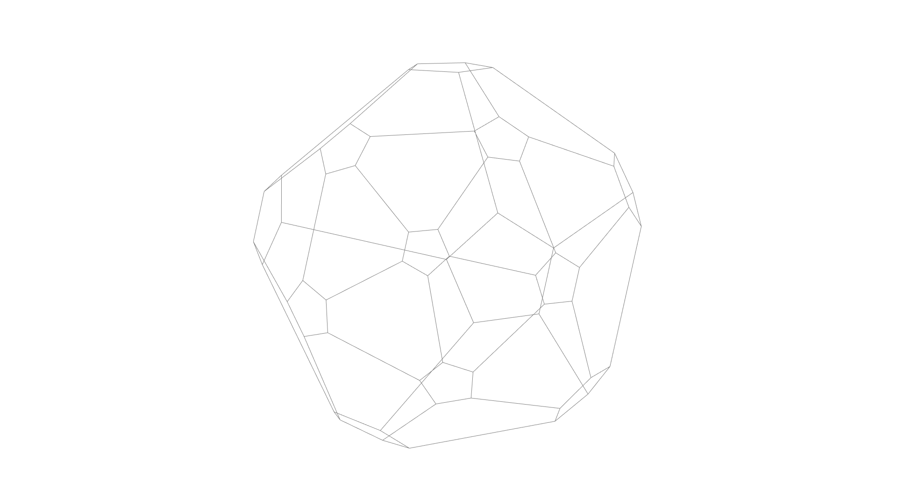

[](https://github.com/ArtifactForms/MeshLibCore/actions/workflows/maven.yml)
[](https://github.com/ArtifactForms/MeshLibCore/actions/workflows/codeql.yml)
[](https://app.codacy.com/gh/ArtifactForms/MeshLibCore/dashboard?utm_source=gh&utm_medium=referral&utm_content=&utm_campaign=Badge_grade)
[](https://codeclimate.com/github/ArtifactForms/MeshLibCore/maintainability)

# Artifact Forms



## Project Overview

**Artifact Forms** is a long-running personal Java project focused on
**3D mesh creation, modification, and procedural geometry**, combined with
ongoing exploration of **engine architecture**, **rendering pipelines**, and
**creative coding workflows**.

The project has grown organically over many years and serves as a **learning
platform**, a **research playground**, and a **toolbox for experimentation**
across multiple technical and artistic domains.

This repository reflects **learning over time** rather than a fixed product
vision.

---

## Background

This project began around **2015 / 2016** as a hobby project to deepen my
understanding of **3D geometry construction and manipulation**.

At that time, I had recently completed an internship with product design
students, where I was introduced to **Processing**. Processing immediately
resonated with me as a tool for visual thinking and rapid experimentation.
Designed for visual learners, it provides an accessible entry point into
programming and graphics. More information can be found at
[processing.org](https://processing.org).

Early versions of Artifact Forms were therefore **strongly Processing-oriented**.
Over time, as my understanding of software architecture, abstraction, and
long-term maintainability evolved, so did the structure and scope of the
project.

---

## What This Project Is

* A **personal learning platform** for graphics, geometry, and engine design
* A **3D mesh library** focused on creation and modification of geometry
* A space to explore **procedural modeling** and **generative techniques**
* A long-term experiment in evolving and maintaining a non-trivial codebase
* A place to practice refactoring, documentation, and architectural design

---

## What This Project Is Not

* ❌ A finished product
* ❌ A professional 3D modeling application
* ❌ A production-ready or performance-optimized engine
* ❌ A stable API with strict backward compatibility guarantees

Some modules are experimental by design. Others are intentionally simple.
Stability and polish vary depending on the area of the project.

---

## Current Focus and Modular Structure

The project is currently being **restructured into clearer conceptual modules**.
This reflects a shift away from a single, Processing-centric scope toward a
more modular and intentional architecture.

### Core Modules

#### `math`

A standalone mathematics module providing:

* vectors and matrices
* geometric primitives
* transformations
* noise and sampling utilities

The `math` module is intended to have **no external dependencies** and to
remain reusable across different environments.

---

#### `mesh`

The core mesh module contains:

* mesh data structures
* mesh creators
* mesh modifiers

This module represents the **core focus** of the project: constructing,
transforming, and analyzing geometry.

---

#### `engine`

An experimental engine layer used to explore:

* scene graphs and hierarchies
* component-based design
* rendering abstractions
* input handling
* resource and asset management

The engine exists primarily for **learning and experimentation**, not as a
finished or general-purpose engine.

---

#### `demos`

An experimental playground used for:

* game jam prototypes
* rapid experimentation
* testing current engine or mesh features in real scenarios

Code in this module prioritizes **iteration speed and experimentation** over
structure or long-term maintainability.

---

### Tooling

#### `workspace`

A **minimal, Processing-based mesh viewer** used to visualize:

* meshes
* face and vertex normals
* edges
* mesh modifiers during development

The workspace is:

* intentionally **Processing-dependent**
* intentionally **limited in scope**
* **not** intended to evolve into a full editor

Its purpose is to support development and debugging of the mesh module, not
to serve as a general-purpose tool.

---

## Long-Term Direction

There is **no rigid roadmap**.

The long-term goals are intentionally loose:

* continue learning and refining geometry and engine concepts
* improve structure, documentation, and testability over time
* extract stable ideas from experiments into cleaner modules
* keep the project enjoyable and sustainable

The project is allowed to change direction, simplify, or pause as needed.

---

## Philosophy

> This project values learning, clarity, and curiosity over completeness.

Artifact Forms exists because it is enjoyable to work on and because it
provides a meaningful space to explore complex technical and creative topics
over the long term.

## Showcase

The following images are showing the library in action.


Subdivision is so beautiful and satisfying too look at.


bend bend bend mesh...


Throwing some conway operations on a cube seed.

## Core elements

- Mesh3D
- Face3D
- Edge3D
- [Creators](#creators)
- Modifiers

## Coordinate System

 * +X → right
 * -Y → up
 * +Y → down
 * -Z → forward

The decision was justified by using the 'Processing' rendering pipeline in the
first place. But the core library is highly decoupled from the 'Processing'
environment. So the library could be used independently.

## Mesh3D

**Important:** This is just an example to illustrate the
base concepts. The library already provides a convenient way to construct
primitives and more complex shapes. But we dive into this at a later point.
For now let's keep things simple. But also keep in mind that it might be useful
to construct shapes by yourself in some cases.

The following example shows how to work with the base mesh class. For this
purpose we want to create a simple quad. The quad has four vertices, one for
each corner. To make things a bit more explanatory we compose the quad out of
two triangular faces.

```
(-1, 0, -1)     (1, 0, -1)
     o--------------o
     |  .           |
     |    .         |
     |      .       |
     |        .     |
     |          .   |
     o--------------o
(-1, 0, 1)      (1, 0, 1)
```

### Mesh3D Object

The base class for all shapes is `mesh.Mesh3D`.

```java
import mesh.Mesh3D;

Mesh3D mesh = new Mesh3D();
```

### Vertex Coordinates

Next we determine the shape's coordinates in Three-Dimensional space.
In this case the shape lies flat on the xz plane, so each y-coordinate is 0.0f.

```java
mesh.add(new Vector3f(1, 0, -1));
mesh.add(new Vector3f(1, 0, 1);
mesh.add(new Vector3f(-1, 0, 1);
mesh.add(new Vector3f(-1, 0, -1);
```

Alternatively use `addVertex(x, y, z)`

```java
mesh.addVertex(1, 0, -1);
mesh.addVertex(1, 0, 1);
mesh.addVertex(-1, 0, 1);
mesh.addVertex(-1, 0, -1);
```

### Construct Faces

The added vertices are now at an indexed position within the mesh.

```
     3              0
     o--------------o
     |  .           |
     |    .         |
     |      .       |
     |        .     |
     |          .   |
     o--------------o
     2              1
```

Knowing the index of each vertex makes adding faces a piece of cake. We only
have to take care of the winding order. In this case the winding order is
counter-clockwise with all face normals pointing up towards negative y.

```java
mesh.addFace(0, 1, 3);
mesh.addFace(1, 2, 3);
```


### Modify the mesh

Now we have a mesh constisting of four vertices and two triangular faces.
This could be retrieved by using:

```java
int vertexCount = mesh.getVertexCount();
int faceCount = mesh.getFaceCount();
```

We can modify the present mesh by using so called _Modifiers_.
Each modifier derives from the root interface `IMeshModifier`.

```java
package mesh.modifier;

import mesh.Mesh3D;

public interface IMeshModifier {

	public Mesh3D modify(Mesh3D mesh);

}
```

Let's say we would like to give our mesh some thickness.
To achieve this we use the _SolidifyModifier_.

```java
SolidifyModifier modifier = new SolidifyModifier();
modifier.setThickness(0.5f);
modifier.modify(mesh);
```

## Creators

Effortless Shape Creation with Mesh Creators

The library provides a variety of Mesh Creators to simplify the construction of
various shapes. These creators employ the Factory Method or Builder design
pattern, allowing for a flexible and streamlined approach.

While similar to a classic builder, Mesh Creators offer a unique combination of
features:

- **Getters and Setters:** Access and modify the creator's internal state using
  getters and setters, providing fine-grained control over the mesh creation
  process.

- **Chaining is not supported:**

With over 100 Mesh Creators categorized for easy access, you can quickly and
efficiently build a wide range of 3D shapes. For a comprehensive overview,
refer to our documentation: [Mesh Creators](documentation/documentation.md)

Core of Mesh Creators: The IMeshCreator Interface

Every Mesh Creator in the library adheres to the IMeshCreator interface.
The following code snippet illustrates this foundational interface:

```java
package mesh.creator;

import mesh.Mesh3D;

public interface IMeshCreator {

	public Mesh3D create();

}
```

To get a little more specific we can plug the quad example code into a custom
creator to illustrate the overall concept.

Let's have a look at our example code again.

```java
import mesh.Mesh3D;
import mesh.creator.IMeshCreator;

Mesh3D mesh = new Mesh3d();
mesh.addVertex(1, 0, -1);
mesh.addVertex(1, 0, 1);
mesh.addVertex(-1, 0, 1);
mesh.addVertex(-1, 0, -1);
mesh.addFace(0, 1, 3);
mesh.addFace(1, 2, 3);
```

First we move our example code into the factory method of a custom mesh
creator class and simply return the mesh.

```java
import mesh.Mesh3D;
import mesh.creator.IMeshCreator;

public class MyQuadCreator implements IMeshCreator {

	public Mesh3D create() {
		Mesh3D mesh = new Mesh3d();
		mesh.addVertex(1, 0, -1);
		mesh.addVertex(1, 0, 1);
		mesh.addVertex(-1, 0, 1);
		mesh.addVertex(-1, 0, -1);
		mesh.addFace(0, 1, 3);
		mesh.addFace(1, 2, 3);
		return mesh;
	}

}
```

Let's assume we want to generalize the code a bit further. We introduce a
parameter for the vertex coordinates named _halfSize_.

```java
import mesh.Mesh3D;

public class MyQuadCreator implements IMeshCreator {

	private float halfSize;

	private Mesh3D mesh;

	public Mesh3D create() {
		initializeMesh();
		createVertices();
		createFaces();
		return mesh;
	}

	private void initializeMesh() {
		mesh = new Mesh3D();
	}

	private void createVertices() {
		addVertex(halfSize, 0, -halfSize);
		addVertex(halfSize, 0, halfSize);
		addVertex(-halfSize, 0, halfSize);
		addVertex(-halfSize, 0, -halfSize);
	}

	private void createFaces() {
		addFace(0, 1, 3);
		addFace(1, 2, 3);
	}

	private void addVertex(float x, float y, float z) {
		mesh.addVertex(x, y, z);
	}

	private void addFace(int... indices) {
		mesh.add(new Face3D(indices));
	}

	public void setSize(float size) {
		halfSize = size / 2.0f;
	}

	public float getSize() {
		return halfSize * 2;
	}

}
```

Now we can use our creator the following way:

```java
Mesh3D mesh;
MyQuadCreator creator = new MyQuadCreator();
creator.setSize(4);
mesh = creator.create();
```

This explains the overall concept of mesh creators pretty well. You should now
have an idea how to use existing creators and implement your own custom ones.

See also: [Mesh Creators](documentation/documentation.md)

## Workspace


The workspace is a **minimal, Processing-based mesh viewer** intended exclusively as a
**developer tool** for working on mesh creators and modifiers.

Its purpose is to:
- visualize meshes
- inspect topology (faces, edges, vertices)
- display face and vertex normals
- support debugging and experimentation during development

### Design Intent

The workspace is intentionally:
- **highly dependent on Processing**
- **not backend-agnostic**
- **not a full editor**
- **not part of the engine core**
- **not intended to evolve into a production tool**

It exists to enable fast iteration and visual feedback while developing the mesh
library. Architectural purity is explicitly **not** a goal here.

A detailed design rationale can be found in:
`docs/design/workspace-design.md`

### Technical Notes

- The workspace runs inside a `PApplet`
- It requires a Processing rendering context
- Direct Processing API usage is expected and accepted

### Example Usage

A simple template can be found under  
**`src/main/java/workspace/examples`**:

```java
import mesh.Mesh3D;
import mesh.creator.primitives.CubeCreator;
import processing.core.PApplet;
import workspace.Workspace;

public class WorkspaceTemplate extends PApplet {

    public static void main(String[] args) {
        PApplet.main(WorkspaceTemplate.class.getName());
    }

    private Mesh3D mesh;
    private Workspace workspace;

    @Override
    public void settings() {
        size(1000, 1000, P3D);
        smooth(8);
    }

    @Override
    public void setup() {
        workspace = new Workspace(this);
        workspace.setGridVisible(true);
        workspace.setUiVisible(true);
        mesh = new CubeCreator().create();
    }

    @Override
    public void draw() {
        workspace.draw(mesh);
    }
}
```

The workspace provides the following features:

**Camera movement:**

- Zoom with the mouse wheel,
- rotate by dragging with the middle mouse button,
- pan by dragging with the middle mouse button and holding down the Shift key,
- navigate in first-person mode using WASD keys.

**Scene manipulation:**

- Reset camera position (C),
- toggle UI visibility (Y),
- toggle grid visibility (G),
- show/hide face and vertex normals (N, V),
- switch between wireframe and solid view (Z),
- show/hide axes (1, 2, 3),
- show/hide edges (E),
- toggle smooth and flat shading (S),
- switch to first-person mode and back (4),
- toggle the rendering loop via the UI.

## Contributing

Artifact Forms is actively under development, with a focus on improving documentation and adding new features. As an open-source project, we welcome contributions from the community.

## Licence

[GNU General Public License](https://github.com/ArtifactForms/MeshLibCore/blob/master/LICENSE)
License Copyright (c) 2022 Simon Dietz
