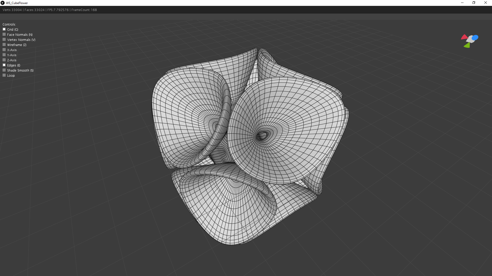
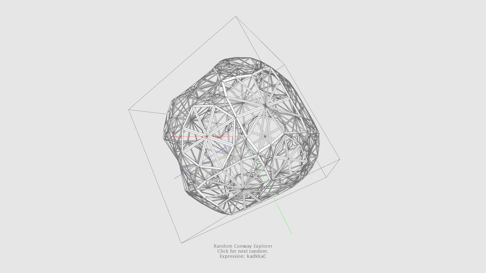
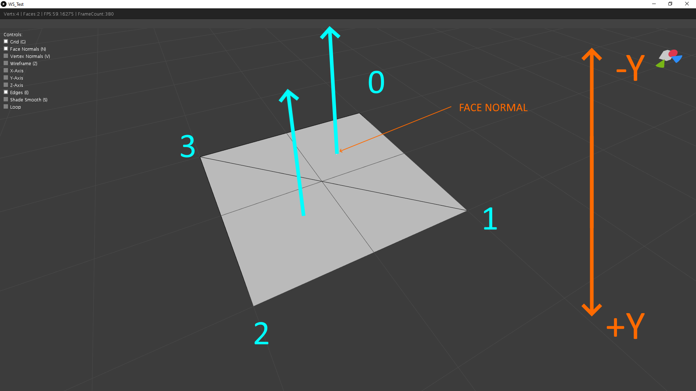

[](https://github.com/ArtifactForms/MeshLibCore/actions/workflows/maven.yml)
[](https://github.com/ArtifactForms/MeshLibCore/actions/workflows/codeql.yml)
[](https://app.codacy.com/gh/ArtifactForms/MeshLibCore/dashboard?utm_source=gh&utm_medium=referral&utm_content=&utm_campaign=Badge_grade)
[](https://codeclimate.com/github/ArtifactForms/MeshLibCore/maintainability)
[](https://github.com/ArtifactForms/MeshLibCore/actions/workflows/maven-publish.yml)

# Artifact Forms

A _JAVA_ library to construct and manipulate geometry in Three-dimensional space.

## Background / Intension

This library is a hobby project started around 2015/2016 with the intension to learn more about
creating and manipulating geometry in Three-dimensional space.
I could build up on some small knowledge I gathered through my internship several years before.
At this time I worked together with university students from the field of product design.
This was also the time I got in touch with a programming language called 'Processing' for the first time. And I was hooked from day one.
Processing is a language created with the intension to help people to learn programming in a visual context.
If you are interested to find out more went to
[processing.org](https://processing.org). But processing is not absolutely necessary, cause the core of the library is decoupled from the processing
environment. Nevertheless processing provides a convenient way to display constructed meshes through it's rendering pipeline. Under the hood processing makes use of _JAVA_, _JAVA2D_ and _OPENGL_.

## Status Quo

At the current stage I mainly work on the user documentation. Over the years I learned new things about code structure and architecture, so codewise a lot of refactoring is going on to keep the project clean. And from time to time small additions are made. Meanwhile all the processing specific and rendering stuff lives in it's own repository. So this is another project to went on with.

Overall the code base is more a playground for working with _legacy code_. I try to love, work and live with legacy code.
It offers the possibility to learn and try new testing approaches. Building tests around existing code for refactroing purposes is quite an interesting and useful field. And in my opinion indispensable.

## Future

There are a lot of corresponding topics out there. So my wishlist of things to learn and implement is unspeakably large.
Some are already listed under 'Planed features'.

## Showcase

The following images are showing the library in action.


Subdivision is so beautiful and satisfying too look at.


bend bend bend mesh...


Throwing some conway operations on a cube seed.

## Features

Will be added soon...

## Core elements

- Mesh3D
- Face3D
- Edge3D
- [Creators](#creators)
- Modifiers

## Coordinate System

The library is build up on a left-handed coordinate system.
The decision was justified by using the 'Processing' rendering pipeline in the first place.
But the core library is highly decoupled from the 'Processing' environment.
So the library could be used independently.

## Mesh3D

The following example shows how to work with the base mesh class. For this purpose we want to create a simple quad. The quad has four vertices, one for each
corner. To make things a bit more explanatory we compose the quad out of two triangular faces. **Important:** This is just an example to illustrate the base concepts. The library already provides a convenient way to construct primitives and more complex shapes. But we dive into this at a later point. For now
let's keep things simple. But also keep in mind that it might be useful to construct shapes by yourself in some cases.

```
(-1, 0, -1)     (1, 0, -1)
     o--------------o
     |  .           |
     |    .         |
     |      .       |
     |        .     |
     |          .   |
     o--------------o
(-1, 0, 1)      (1, 0, 1)
```

### Mesh3D Object

The base class for all shapes is `mesh.Mesh3D`.

```java
import mesh.Mesh3D;

Mesh3D mesh = new Mesh3D();
```

### Vertex Coordinates

Next we determine the shape's coordinates in Three-Dimensional space. In this case the shape lies flat on the xz plane, so each y-coordinate is 0.0f.

```java
mesh.add(new Vector3f(1, 0, -1));
mesh.add(new Vector3f(1, 0, 1);
mesh.add(new Vector3f(-1, 0, 1);
mesh.add(new Vector3f(-1, 0, -1);
```

Alternatively use `addVertex(x, y, z)`

```java
mesh.addVertex(1, 0, -1);
mesh.addVertex(1, 0, 1);
mesh.addVertex(-1, 0, 1);
mesh.addVertex(-1, 0, -1);
```

### Construct Faces

The added vertices are now at an indexed position within the mesh.

```
     3              0
     o--------------o
     |  .           |
     |    .         |
     |      .       |
     |        .     |
     |          .   |
     o--------------o
     2              1
```

Knowing the index of each vertex makes adding faces a piece of cake. We only have to take care of the winding order. In this case the winding order
is counter-clockwise with all face normals pointing up towards negative y.

```java
mesh.addFace(0, 1, 3);
mesh.addFace(1, 2, 3);
```



### Modify the mesh

Now we have a mesh constisting of four vertices and two triangular faces. This could be retrieved by using:

```java
int vertexCount = mesh.getVertexCount();
int faceCount = mesh.getFaceCount();
```

We can modify the present mesh by using so called _Modifiers_. Each modifier derives from the root interface `IMeshModifier`.

```java
package mesh.modifier;

import mesh.Mesh3D;

public interface IMeshModifier {

	public Mesh3D modify(Mesh3D mesh);

}
```

Let's say we would like to give our mesh some thickness.
To achieve this we use the _SolidifyModifier_.

```java
SolidifyModifier modifier = new SolidifyModifier();
modifier.setThickness(0.5f);
modifier.modify(mesh);
```

## Creators

The library provides a variety of so called mesh 'Creators' to construct various shapes the convenient way.
More precisely the 'Factory Method' / 'Builder' pattern was applied for this purpose. A mesh creator works like a classis builder.
The creator differs mainly in two points from a classic builder. We also provide getters and chaining was left out.
In the meantime the library contains 100+ different mesh creators divided in various categories.
Get a first impression and overview here: [Mesh Creators](https://github.com/ArtifactForms/MeshLibCoreClean2022/blob/master/MeshLibCoreClean2022/documentation/documentation.md).
Each creator derives from the 'IMeshCreator' interface. The following code example shows the mentioned root interface for all mesh creators.

```java
package mesh.creator;

import mesh.Mesh3D;

public interface IMeshCreator {

	public Mesh3D create();

}
```

To get a little more specific we can plug the quad example code into a custom creator to illustrate the overall concept.
Let's have a look at our example code again.

```java
import mesh.Mesh3D;
import mesh.creator.IMeshCreator;

Mesh3D mesh = new Mesh3d();
mesh.addVertex(1, 0, -1);
mesh.addVertex(1, 0, 1);
mesh.addVertex(-1, 0, 1);
mesh.addVertex(-1, 0, -1);
mesh.addFace(0, 1, 3);
mesh.addFace(1, 2, 3);
```

First we move our example code into the factory method of a custom mesh creator class and simply return the mesh.

```java
import mesh.Mesh3D;
import mesh.creator.IMeshCreator;

public class MyQuadCreator implements IMeshCreator {

	public Mesh3D create() {
		Mesh3D mesh = new Mesh3d();
		mesh.addVertex(1, 0, -1);
		mesh.addVertex(1, 0, 1);
		mesh.addVertex(-1, 0, 1);
		mesh.addVertex(-1, 0, -1);
		mesh.addFace(0, 1, 3);
		mesh.addFace(1, 2, 3);
		return mesh;
	}

}
```

Let's assume we want to generalize the code a bit further. We introduce a parameter for the vertex coordinates named _halfSize_.

```java
import mesh.Mesh3D;

public class MyQuadCreator implements IMeshCreator {

	private float halfSize;
	private Mesh3D mesh;

	public Mesh3D create() {
		initializeMesh();
		createVertices();
		createFaces();
		return mesh;
	}

	private void initializeMesh() {
		mesh = new Mesh3D();
	}

	private void createVertices() {
		addVertex(halfSize, 0, -halfSize);
		addVertex(halfSize, 0, halfSize);
		addVertex(-halfSize, 0, halfSize);
		addVertex(-halfSize, 0, -halfSize);
	}

	private void createFaces() {
		addFace(0, 1, 3);
		addFace(1, 2, 3);
	}

	private void addVertex(float x, float y, float z) {
		mesh.addVertex(x, y, z);
	}

	private void addFace(int... indices) {
		mesh.add(new Face3D(indices));
	}

	public void setSize(float size) {
		halfSize = size / 2.0f;
	}

	public float getSize() {
		return halfSize * 2;
	}

}
```

Now we can use our creator the following way:

```java
Mesh3D mesh;
MyQuadCreator creator = new MyQuadCreator();
creator.setSize(4);
mesh = creator.create();
```

This explains the overall concept of mesh creators pretty well. You should now have an idea how to use existing creators and implement your own custom ones.
See also: [Mesh Creators](https://github.com/ArtifactForms/MeshLibCoreClean2022/blob/master/MeshLibCoreClean2022/documentation/documentation.md)

## Planed features

- Convex Hull
- Poisson-Disc Sampling
- Marching Cubes

## Licence

[MIT](https://github.com/ArtifactForms/MeshLibCore/blob/master/LICENSE) License Copyright (c) 2022 Simon Dietz

