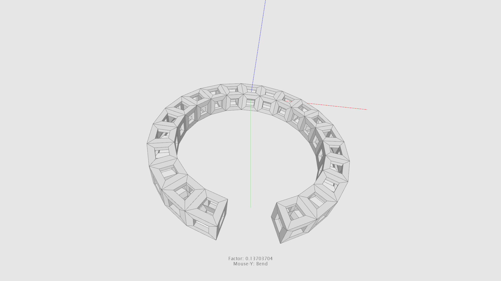
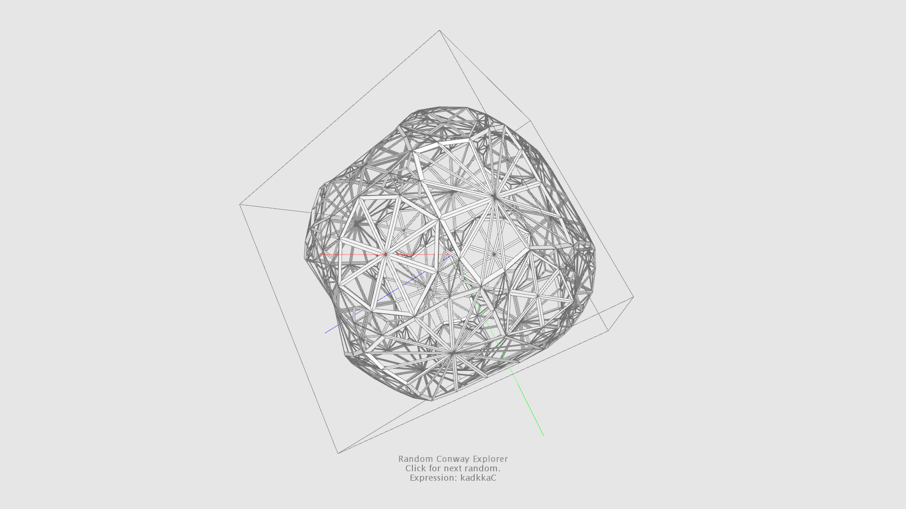

# Artifact Forms
A *JAVA* library to construct and manipulate geometry in Three-dimensional space.

## Background / Intension
This library is a hobby project started around 2015/2016 with the intension to learn more about
creating and manipulating geometry in Three-dimensional space. 
I could build up on some small knowledge I gathered through my internship several years before.
At this time I worked together with university students from the field of product design.
This was also the time I got in touch with a programming language called 'Processing' for the first time. And I was hooked from day one.
Processing is a language created with the intension to help people to learn programming in a visual context.
If you are interested to find out more went to 
[processing.org](https://processing.org). But processing is not absolutely necessary, cause the core of the library is decoupled from the processing
environment. Nevertheless processing provides a convenient way to display constructed meshes through it's rendering pipeline. Under the hood processing makes use of *JAVA*, *JAVA2D* and *OPENGL*.

## Showcase





## Status Quo
At the current stage I mainly work on the user documentation. Codewise a lot of refactoring is going on to keep the project clean. And from time to time small additions are made. Meanwhile all the processing specific and rendering stuff lives in it's own repository. So this is another project to went on with.

## Future
There are a lot of corresponding topics out there. So my wishlist of things to learn and implement is unspeakably large.
Some of them are already listed under 'Planed features'.

## Core elements
* Mesh3D
* Face3D
* Edge3D
* [Creators](https://github.com/ArtifactForms/MeshLibCoreClean2022/blob/master/MeshLibCoreClean2022/documentation/documentation.md)
* Modifiers

## Mesh3D
The following example shows how to work with the base mesh class. For this purpose we want to create a simple Quad. The quad has four vertices, one for each
corner. To make things a bit more explanatory we compose the quad out of two triangular faces.

### Mesh3D Object
The base class for all shapes is **mesh.Mesh3D**.

```java
import mesh.Mesh3D;

Mesh3D mesh = new Mesh3D();
```
Next we determine the shape's coordinates in Three-Dimensional space. In this case the shape lies flat on the xz plane, so each y-coordinate is 0.0f.
```java
mesh.add(new Vector3f(1, 0, -1));
mesh.add(new Vector3f(1, 0, 1);
mesh.add(new Vector3f(-1, 0, 1);
mesh.add(new Vector3f(-1, 0, -1);
```

## Creators
The library provides a variety of so called mesh 'Creators' to construct various shapes the convenient way.
More precisely the 'Factory Pattern' was applied for this purpose.
In the meantime the library contains 100+ different mesh creators divided in various categories.
Get a first impression and overview here: [Mesh Creators](https://github.com/ArtifactForms/MeshLibCoreClean2022/blob/master/MeshLibCoreClean2022/documentation/documentation.md).
Each creator derives from the 'IMeshCreator' interface. The following code example shows the mentioned root interface for all mesh creators. 

```java
package mesh.creator;

import mesh.Mesh3D;

public interface IMeshCreator {

	public Mesh3D create();
	
}

```
## Coordinate System
The library is build up on a left-handed coordinate system.
The decision was justified by using the 'Processing' rendering pipeline in the first place.
But the core library is highly decoupled from the 'Processing' environment.
So the library could be used independently.

## Planed features
* Convex Hull
* Poisson-Disc Sampling
* Marching Cubes
