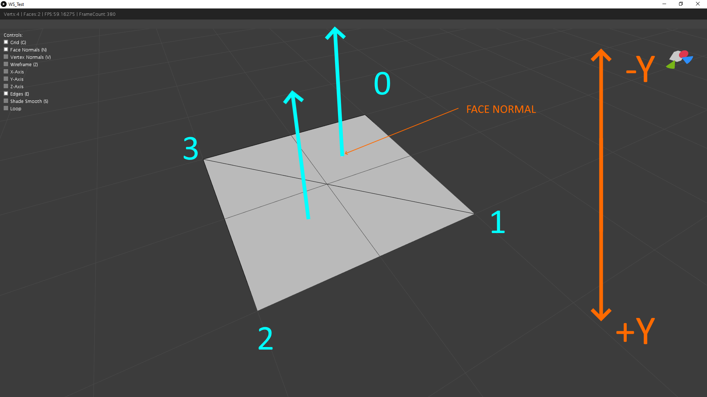
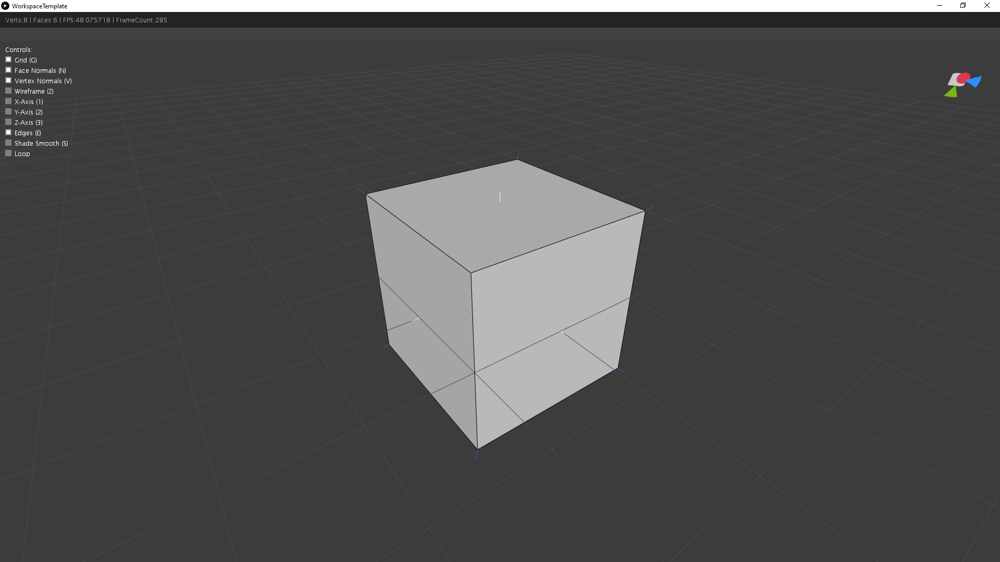

[](https://github.com/ArtifactForms/MeshLibCore/actions/workflows/maven.yml)
[](https://github.com/ArtifactForms/MeshLibCore/actions/workflows/codeql.yml)
[](https://app.codacy.com/gh/ArtifactForms/MeshLibCore/dashboard?utm_source=gh&utm_medium=referral&utm_content=&utm_campaign=Badge_grade)
[](https://codeclimate.com/github/ArtifactForms/MeshLibCore/maintainability)
[](https://github.com/ArtifactForms/MeshLibCore/actions/workflows/maven-publish.yml)

# Artifact Forms

A _JAVA_ library to construct and manipulate geometry in Three-dimensional space.

## Background / Intension

This Java library began as a hobby project in 2015/2016.  I started it to
deepen my understanding of creating and manipulating 3D geometry. This built
upon knowledge I gained from an earlier internship with product design students.
During that time, I was introduced to the programming language Processing.

Processing captivated me from the start. Designed for visual learners,
Processing is a great tool to get started with programming. You can learn more
at processing.org. While Processing isn't strictly necessary, the library's
core functionality is independent of the Processing environment. However,
Processing offers a convenient way to visualize constructed meshes through its
rendering pipeline, which leverages JAVA, JAVA2D, and OPENGL.

## Status Quo
Currently, my primary focus is on refining the user documentation. As my
understanding of code structure and architecture has evolved, I've been
actively refactoring the codebase to maintain its cleanliness and organization.
Smaller additions are made periodically.

In essence, this codebase serves as a platform for learning and working with
legacy code. I've embraced the challenge of working with existing code, viewing
it as an opportunity to explore new testing approaches. Constructing tests
around legacy code for refactoring purposes is a fascinating and valuable
endeavor, in my opinion, an essential practice.

## Future

The scope of related topics is vast, and my list of potential features is 
accordingly expansive. Some of these are outlined under 'Planned Features'.

## Core Features

* **3D Geometry Creation and Manipulation** Build a wide range of 3D shapes and
modify them using various operations.
* **Customizable Mesh Creation:** Create custom shapes using a variety of mesh
creation tools and modifiers.
* **Extensible Framework:** Easily add new features and functionalities to the
library.
* **OBJ File Import and Export:** Import and export 3D models in the OBJ file
format.

## Showcase

The following images are showing the library in action.


Subdivision is so beautiful and satisfying too look at.


bend bend bend mesh...


Throwing some conway operations on a cube seed.

## Core elements

- Mesh3D
- Face3D
- Edge3D
- [Creators](#creators)
- Modifiers

## Coordinate System

The library is build up on a left-handed coordinate system.
The decision was justified by using the 'Processing' rendering pipeline in the
first place. But the core library is highly decoupled from the 'Processing'
environment. So the library could be used independently.

## Mesh3D

The following example shows how to work with the base mesh class. For this 
purpose we want to create a simple quad. The quad has four vertices, one for
each corner. To make things a bit more explanatory we compose the quad out of 
two triangular faces. **Important:** This is just an example to illustrate the 
base concepts. The library already provides a convenient way to construct 
primitives and more complex shapes. But we dive into this at a later point. 
For now let's keep things simple. But also keep in mind that it might be useful 
to construct shapes by yourself in some cases.

```
(-1, 0, -1)     (1, 0, -1)
     o--------------o
     |  .           |
     |    .         |
     |      .       |
     |        .     |
     |          .   |
     o--------------o
(-1, 0, 1)      (1, 0, 1)
```

### Mesh3D Object

The base class for all shapes is `mesh.Mesh3D`.

```java
import mesh.Mesh3D;

Mesh3D mesh = new Mesh3D();
```

### Vertex Coordinates

Next we determine the shape's coordinates in Three-Dimensional space. 
In this case the shape lies flat on the xz plane, so each y-coordinate is 0.0f.

```java
mesh.add(new Vector3f(1, 0, -1));
mesh.add(new Vector3f(1, 0, 1);
mesh.add(new Vector3f(-1, 0, 1);
mesh.add(new Vector3f(-1, 0, -1);
```

Alternatively use `addVertex(x, y, z)`

```java
mesh.addVertex(1, 0, -1);
mesh.addVertex(1, 0, 1);
mesh.addVertex(-1, 0, 1);
mesh.addVertex(-1, 0, -1);
```

### Construct Faces

The added vertices are now at an indexed position within the mesh.

```
     3              0
     o--------------o
     |  .           |
     |    .         |
     |      .       |
     |        .     |
     |          .   |
     o--------------o
     2              1
```

Knowing the index of each vertex makes adding faces a piece of cake. We only 
have to take care of the winding order. In this case the winding order is 
counter-clockwise with all face normals pointing up towards negative y.

```java
mesh.addFace(0, 1, 3);
mesh.addFace(1, 2, 3);
```



### Modify the mesh

Now we have a mesh constisting of four vertices and two triangular faces. 
This could be retrieved by using:

```java
int vertexCount = mesh.getVertexCount();
int faceCount = mesh.getFaceCount();
```

We can modify the present mesh by using so called _Modifiers_. 
Each modifier derives from the root interface `IMeshModifier`.

```java
package mesh.modifier;

import mesh.Mesh3D;

public interface IMeshModifier {

	public Mesh3D modify(Mesh3D mesh);

}
```

Let's say we would like to give our mesh some thickness.
To achieve this we use the _SolidifyModifier_.

```java
SolidifyModifier modifier = new SolidifyModifier();
modifier.setThickness(0.5f);
modifier.modify(mesh);
```

## Creators

Effortless Shape Creation with Mesh Creators

The library provides a variety of Mesh Creators to simplify the construction of 
various shapes. These creators employ the Factory Method or Builder design
pattern, allowing for a flexible and streamlined approach.

While similar to a classic builder, Mesh Creators offer a unique combination of
features:

* **Getters and Setters:** Access and modify the creator's internal state using
getters and setters, providing fine-grained control over the mesh creation
process.

* **Chaining is not supported:**

With over 100 Mesh Creators categorized for easy access, you can quickly and 
efficiently build a wide range of 3D shapes. For a comprehensive overview,
refer to our documentation: [Mesh Creators](documentation/documentation.md)

Core of Mesh Creators: The IMeshCreator Interface

Every Mesh Creator in the library adheres to the IMeshCreator interface.
The following code snippet illustrates this foundational interface:

```java
package mesh.creator;

import mesh.Mesh3D;

public interface IMeshCreator {

	public Mesh3D create();

}
```

To get a little more specific we can plug the quad example code into a custom 
creator to illustrate the overall concept.

Let's have a look at our example code again.

```java
import mesh.Mesh3D;
import mesh.creator.IMeshCreator;

Mesh3D mesh = new Mesh3d();
mesh.addVertex(1, 0, -1);
mesh.addVertex(1, 0, 1);
mesh.addVertex(-1, 0, 1);
mesh.addVertex(-1, 0, -1);
mesh.addFace(0, 1, 3);
mesh.addFace(1, 2, 3);
```

First we move our example code into the factory method of a custom mesh 
creator class and simply return the mesh.

```java
import mesh.Mesh3D;
import mesh.creator.IMeshCreator;

public class MyQuadCreator implements IMeshCreator {

	public Mesh3D create() {
		Mesh3D mesh = new Mesh3d();
		mesh.addVertex(1, 0, -1);
		mesh.addVertex(1, 0, 1);
		mesh.addVertex(-1, 0, 1);
		mesh.addVertex(-1, 0, -1);
		mesh.addFace(0, 1, 3);
		mesh.addFace(1, 2, 3);
		return mesh;
	}

}
```

Let's assume we want to generalize the code a bit further. We introduce a 
parameter for the vertex coordinates named _halfSize_.

```java
import mesh.Mesh3D;

public class MyQuadCreator implements IMeshCreator {

	private float halfSize;

	private Mesh3D mesh;

	public Mesh3D create() {
		initializeMesh();
		createVertices();
		createFaces();
		return mesh;
	}

	private void initializeMesh() {
		mesh = new Mesh3D();
	}

	private void createVertices() {
		addVertex(halfSize, 0, -halfSize);
		addVertex(halfSize, 0, halfSize);
		addVertex(-halfSize, 0, halfSize);
		addVertex(-halfSize, 0, -halfSize);
	}

	private void createFaces() {
		addFace(0, 1, 3);
		addFace(1, 2, 3);
	}

	private void addVertex(float x, float y, float z) {
		mesh.addVertex(x, y, z);
	}

	private void addFace(int... indices) {
		mesh.add(new Face3D(indices));
	}

	public void setSize(float size) {
		halfSize = size / 2.0f;
	}

	public float getSize() {
		return halfSize * 2;
	}

}
```

Now we can use our creator the following way:

```java
Mesh3D mesh;
MyQuadCreator creator = new MyQuadCreator();
creator.setSize(4);
mesh = creator.create();
```

This explains the overall concept of mesh creators pretty well. You should now
have an idea how to use existing creators and implement your own custom ones.

See also: [Mesh Creators](documentation/documentation.md)

## Workspace

The workspace serves as a simple mesh viewer, providing a convenient way to 
visualize and inspect 3D models. It offers basic functionalities without aiming to be 
a full-fledged modeling software. Currently, its sole purpose is to support the work 
with the mesh library.

In its current version, the viewer is tightly coupled to the Processing environment,
which is used as the rendering pipeline. The workspace exists within a PApplet and
requires a reference to this PApplet to function.



A simple template can be found within the package src/main/java/workspace/examples, ready to fire up and give it a first try:

```java
import mesh.Mesh3D;
import mesh.creator.primitives.CubeCreator;
import processing.core.PApplet;
import workspace.Workspace;

public class WorkspaceTemplate extends PApplet {

    public static void main(String[] args) {
        PApplet.main(WorkspaceTemplate .class.getName());
    }

    Mesh3D mesh;

    Workspace workspace;

    @Override
    public void settings() {
        size(1000, 1000, P3D);
        smooth(8);
    }

    @Override
    public void setup() {
        workspace = new Workspace(this);
        workspace.setGridVisible(true);
        workspace.setUiVisible(true);
        createMesh();
    }

    @Override
    public void draw() {
        workspace.draw(mesh);
    }

    public void createMesh() {
        CubeCreator creator = new CubeCreator();
        mesh = creator.create();
    }

}
```

The workspace provides the following features:

**Camera movement:** 

* Zoom with the mouse wheel,
* rotate by dragging with the middle mouse button,
* pan by dragging with the middle mouse button and holding down the Shift key,
* navigate in first-person mode using WASD keys.

**Scene manipulation:** 

* Reset camera position (C),
* toggle UI visibility (Y),
* toggle grid visibility (G),
* show/hide face and vertex normals (N, V),
* switch between wireframe and solid view (Z),
* show/hide axes (1, 2, 3),
* show/hide edges (E),
* toggle smooth and flat shading (S),
* switch to first-person mode and back (4),
* toggle the rendering loop via the UI.

## Planed features

- Convex Hull
- Poisson-Disc Sampling
- Marching Cubes

## Licence

[MIT](https://github.com/ArtifactForms/MeshLibCore/blob/master/LICENSE)
License Copyright (c) 2022 Simon Dietz

