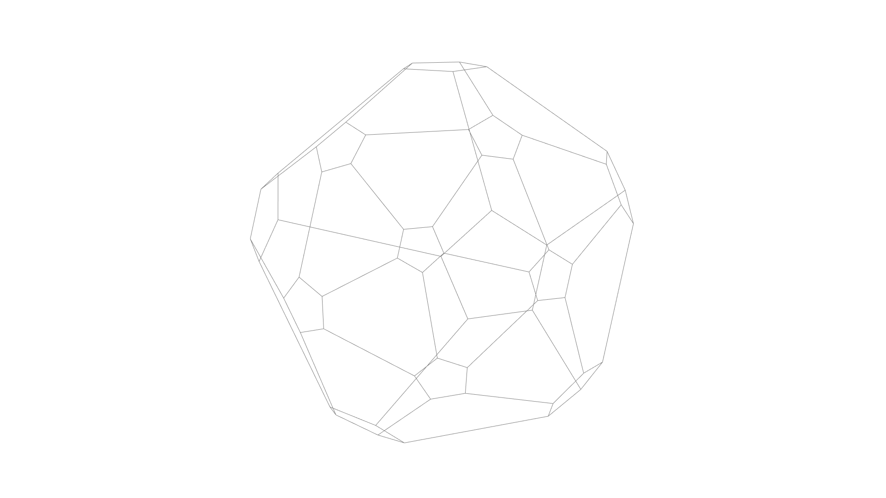
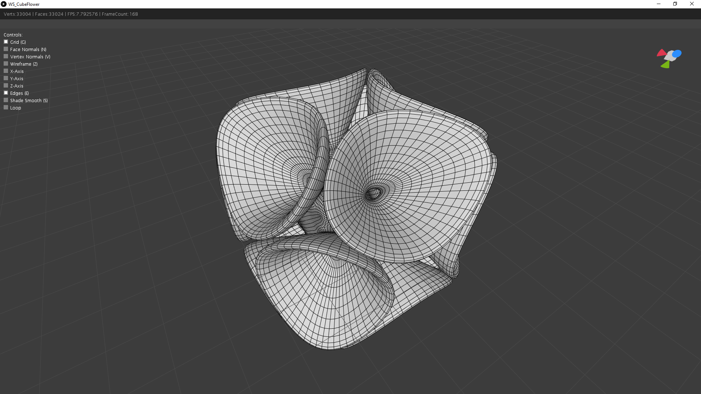
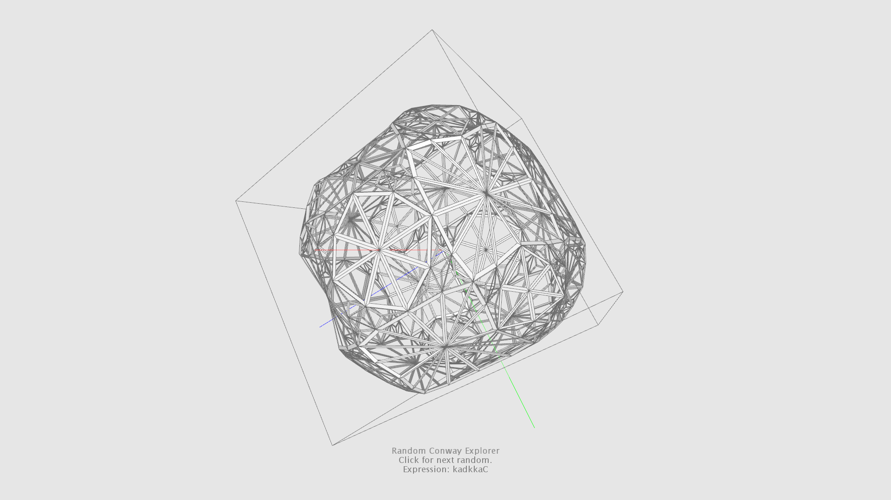
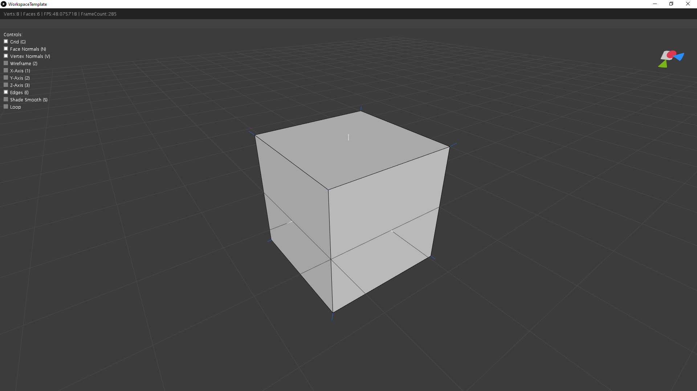

[](https://github.com/ArtifactForms/MeshLibCore/actions/workflows/maven.yml)
[](https://github.com/ArtifactForms/MeshLibCore/actions/workflows/codeql.yml)
[](https://app.codacy.com/gh/ArtifactForms/MeshLibCore/dashboard?utm_source=gh&utm_medium=referral&utm_content=&utm_campaign=Badge_grade)

# Artifact Forms



## Project Overview

**Artifact Forms** is a long-running personal Java project focused on
**3D mesh creation, modification, and procedural geometry**, combined with
ongoing exploration of **engine architecture**, **rendering pipelines**, and
**creative coding workflows**.

The project has grown organically over many years and serves as a
**learning platform**, a **research playground**, and a **toolbox for
experimentation** across multiple technical and artistic domains.

This repository reflects **learning over time** rather than a fixed
product vision.

---

## Background

This project began around **2015 / 2016** as a hobby project to deepen my
understanding of **3D geometry construction and manipulation**.

At that time, I had recently completed an internship with product design
students, where I was introduced to **Processing**. Processing immediately
resonated with me as a tool for visual thinking and rapid experimentation.
Designed for visual learners, it provides an accessible entry point into
programming and graphics. More information can be found at
[processing.org](https://processing.org).

Early versions of Artifact Forms were therefore **strongly
Processing-oriented**. Over time, as my understanding of software
architecture, abstraction, and long-term maintainability evolved, so did
the structure and scope of the project.

---

## What This Project Is

* A **personal learning platform** for graphics, geometry, and engine design
* A **3D mesh library** focused on creation and modification of geometry
* A space to explore **procedural modeling** and **generative techniques**
* A long-term experiment in evolving and maintaining a non-trivial codebase
* A place to practice refactoring, documentation, and architectural design

---

## What This Project Is Not

* ❌ A finished product
* ❌ A professional 3D modeling application
* ❌ A production-ready or performance-optimized engine
* ❌ A stable API with strict backward compatibility guarantees

Some modules are experimental by design. Others are intentionally simple.
Stability and polish vary depending on the area of the project.

---

## Current Focus and Modular Structure

The project is currently being **restructured into clearer conceptual
modules**. This reflects a shift away from a single,
Processing-centric scope toward a more modular and intentional
architecture.

### Core Modules

#### `math`

A standalone mathematics module providing:

* vectors and matrices
* geometric primitives
* transformations
* noise and sampling utilities

The `math` module is intended to have **no external dependencies** and to
remain reusable across different environments.

---

#### `mesh`

The core mesh module contains:

* mesh data structures
* mesh creators
* mesh modifiers

This module represents the **core focus** of the project: constructing,
transforming, and analyzing geometry.

---

#### `engine`

An experimental engine layer used to explore:

* scene graphs and hierarchies
* component-based design
* rendering abstractions
* input handling
* resource and asset management

The engine exists primarily for **learning and experimentation**, not as
a finished or general-purpose engine.

---

#### `demos`

An experimental playground used for:

* game jam prototypes
* rapid experimentation
* testing current engine or mesh features in real scenarios

Code in this module prioritizes **iteration speed and experimentation**
over structure or long-term maintainability.

---

### Tooling

#### `workspace`

A **minimal, Processing-based mesh viewer** used to visualize:

* meshes
* face and vertex normals
* edges
* mesh modifiers during development

The workspace is:

* intentionally **Processing-dependent**
* intentionally **limited in scope**
* **not** intended to evolve into a full editor

Its purpose is to support development and debugging of the mesh module,
not to serve as a general-purpose tool.

---

## Long-Term Direction

There is **no rigid roadmap**.

The long-term goals are intentionally loose:

* continue learning and refining geometry and engine concepts
* improve structure, documentation, and testability over time
* extract stable ideas from experiments into cleaner modules
* keep the project enjoyable and sustainable

The project is allowed to change direction, simplify, or pause as needed.

---

## Philosophy

> This project values learning, clarity, and curiosity over completeness.

Artifact Forms exists because it is enjoyable to work on and because it
provides a meaningful space to explore complex technical and creative
topics over the long term.

## Showcase

The following images are showing the library in action.



Subdivision is so beautiful and satisfying to look at.


bend bend bend mesh...



Throwing some conway operations on a cube seed.

## Core Elements

* Mesh3D
* Face3D
* Edge3D
* [Creators](#creators)
* Modifiers

## Coordinate System

* +X → right
* -Y → up
* +Y → down
* -Z → forward

The decision was justified by using the 'Processing' rendering pipeline
in the first place. But the core library is highly decoupled from the
'Processing' environment. So the library could be used independently.

## Mesh3D

**Important:** This is just an example to illustrate the base concepts.
The library already provides a convenient way to construct primitives and
more complex shapes. But we dive into this at a later point. For now,
let's keep things simple.

### Mesh3D Object

```java
import mesh.Mesh3D;

Mesh3D mesh = new Mesh3D();
```

### Vertex Coordinates

```java
mesh.addVertex(1, 0, -1);
mesh.addVertex(1, 0, 1);
mesh.addVertex(-1, 0, 1);
mesh.addVertex(-1, 0, -1);
```

### Construct Faces

```java
mesh.addFace(0, 1, 3);
mesh.addFace(1, 2, 3);
```

### Modify the Mesh

```java
int vertexCount = mesh.getVertexCount();
int faceCount = mesh.getFaceCount();
```

```java
SolidifyModifier modifier = new SolidifyModifier();
modifier.setThickness(0.5f);
modifier.modify(mesh);
```

## Creators

### IMeshCreator Interface

```java
package mesh.creator;

import mesh.Mesh3D;

public interface IMeshCreator {

    public Mesh3D create();

}
```

### Example Creator

```java
public class MyQuadCreator implements IMeshCreator {

    private float halfSize;
    private Mesh3D mesh;

    public Mesh3D create() {
        initializeMesh();
        createVertices();
        createFaces();
        return mesh;
    }

    private void initializeMesh() {
        mesh = new Mesh3D();
    }

    private void createVertices() {
        addVertex(halfSize, 0, -halfSize);
        addVertex(halfSize, 0, halfSize);
        addVertex(-halfSize, 0, halfSize);
        addVertex(-halfSize, 0, -halfSize);
    }

    private void createFaces() {
        addFace(0, 1, 3);
        addFace(1, 2, 3);
    }

    private void addVertex(float x, float y, float z) {
        mesh.addVertex(x, y, z);
    }

    private void addFace(int... indices) {
        mesh.add(new Face3D(indices));
    }

    public void setSize(float size) {
        halfSize = size / 2.0f;
    }

    public float getSize() {
        return halfSize * 2;
    }

}
```

## Workspace



The workspace is a **minimal, Processing-based mesh viewer** intended
exclusively as a **developer tool**.

### Example Usage

```java
public class WorkspaceTemplate extends PApplet {

    public static void main(String[] args) {
        PApplet.main(WorkspaceTemplate.class.getName());
    }

    private Mesh3D mesh;
    private Workspace workspace;

    @Override
    public void settings() {
        size(1000, 1000, P3D);
        smooth(8);
    }

    @Override
    public void setup() {
        workspace = new Workspace(this);
        workspace.setGridVisible(true);
        workspace.setUiVisible(true);
        mesh = new CubeCreator().create();
    }

    @Override
    public void draw() {
        workspace.draw(mesh);
    }
}
```

## Contributing

Artifact Forms is actively under development, with a focus on improving
documentation and adding new features. Contributions are welcome.

## Licence

[GNU General Public License](https://github.com/ArtifactForms/MeshLibCore/blob/master/LICENSE)

License Copyright (c) 2022 Simon Dietz
