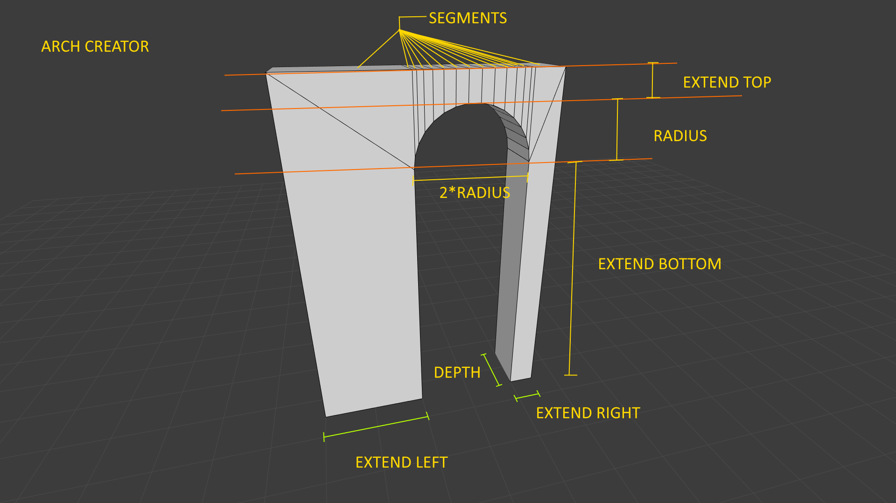
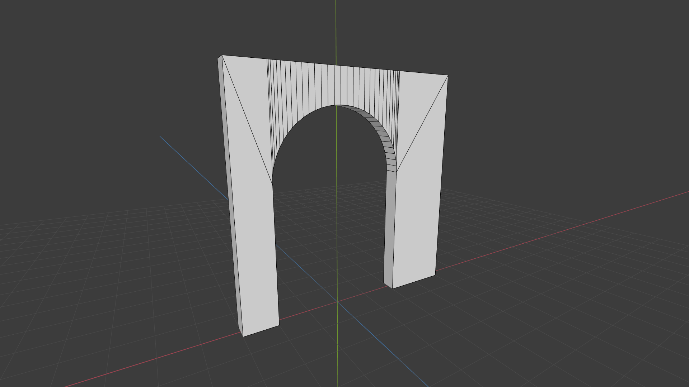
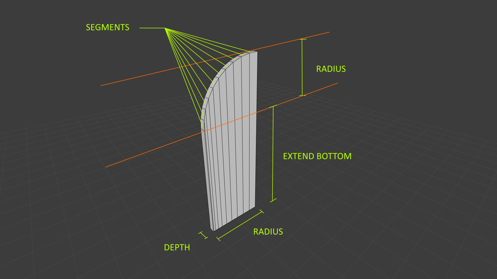
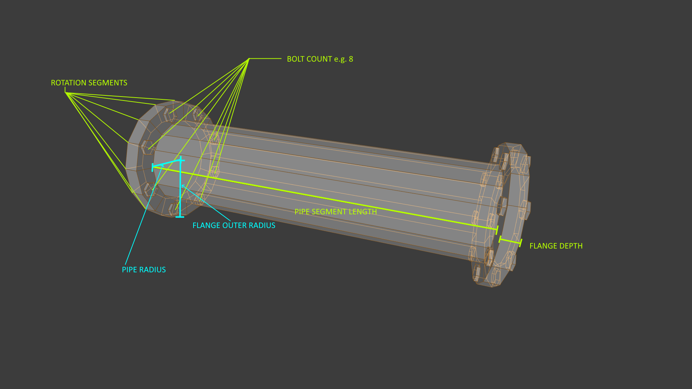
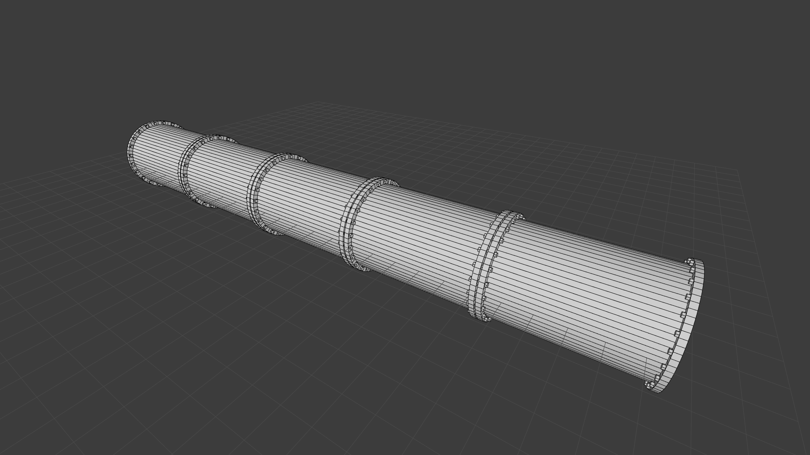

# Asset Creators

## ArchCreator



**Example**

```java
Mesh3D mesh;
ArchCreator creator = new ArchCreator();
creator.setSegments(32);
creator.setRadius(2);
creator.setExtendTop(1);
creator.setExtendBottom(4);
creator.setExtendLeft(1);
creator.setExtendRight(2);
creator.setDepth(0.5f);
mesh = creator.create();

````



## ArchDoorCreator



**Example**

```java
Mesh3D mesh;
ArchDoorCreator creator = new ArchDoorCreator();
creator.setRadius(2);
creator.setDepth(0.2f);
creator.setExtendBottom(4);
creator.setSegments(10);
mesh = creator.create();
```

## FlangedPipeCreator



**Example**

```java
Mesh3D mesh;
FlangePipeCreator creator = new FlangePipeCreator();
creator.setSegmentCount(5);
creator.setBoltCount(24);
creator.setRotationSegments(64);
creator.setFlangeOuterRadius(2);
creator.setFlangeGrooveWidth(0.05f);
creator.setPipeRadius(1.8f);
creator.setFlangeDepth(0.2f);
creator.setPipeSegmentLength(5);
creator.setBoltHeadPercantage(0.8f);
creator.setBoltHeadHeight(0.08f);
creator.setBoltCapFillType(FillType.N_GON);
mesh = creator.create();
```

