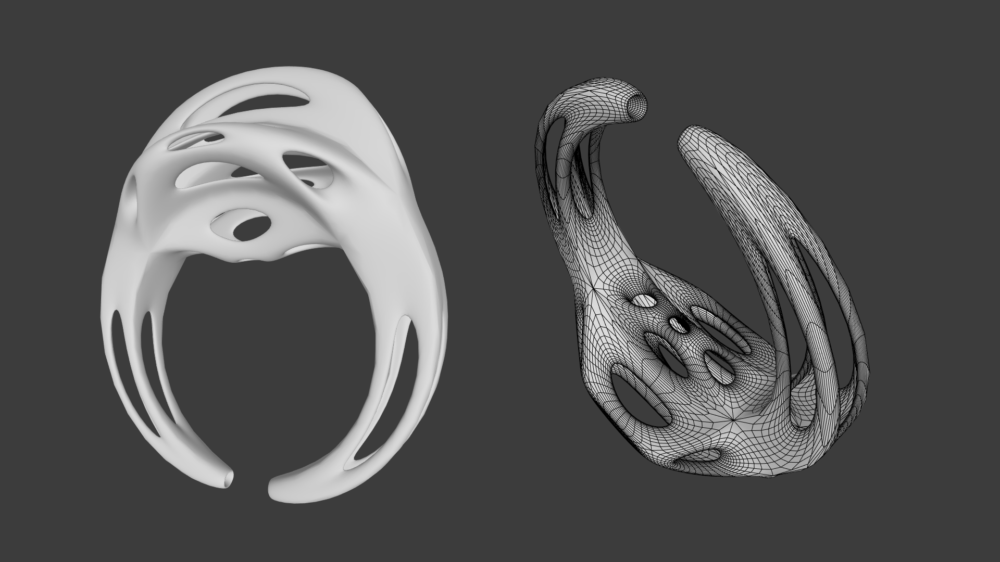

# Mesh Modifiers

## Understanding Mesh Modifiers

Mesh modifiers are powerful tools for transforming 3D meshes. They allow you to apply various
geometric operations, such as translation, rotation, scaling, bending, and more. By understanding
the core concepts and how to use these modifiers effectively, you can create a wide range of 3D
shapes and effects.

The library offers a versatile set of pre-built modifiers, each adhering to the ```IMeshModifier``` interface. 
If you aim to extend the library with custom modifiers, ensuring adherence to this interface is crucial.

```java
package mesh.modifier;

import mesh.Mesh3D;

public interface IMeshModifier {

    public Mesh3D modify(Mesh3D mesh);

}
```

**Key Point:** Returning a Modified Reference

An aspect of the ```IMeshModifier``` interface is that the modify method returns a reference to the modified mesh.

**Applying Modifications**

You can apply modifications to a mesh in two primary ways:

**1. Direct Modification:**

```java
Mesh3D cube = new CubeCreator().create();
ScaleModifier scaleModifier = new ScaleModifier(10);
scaleModifier.modify(cube);
```

**2. Mesh-Based Application:**

```java
Mesh3D cube = new CubeCreator().create();
ScaleModifier scaleModifier = new ScaleModifier(10);
cube.apply(scaleModifier);
```

The preferred approach depends on your specific use case and coding style. However,
it's recommended to maintain consistency within your project to enhance code readability
and maintainability.

## A Practical Example: Creating a Complex Shape

To demonstrate the power of combining multiple modifiers, let's create a complex shape:



```java
Mesh3D mesh = new CubeCreator().create();
mesh.apply(new ExtrudeModifier(0.4f, 2));
mesh.apply(new HolesModifier());
mesh.apply(new SolidifyModifier(0.2f));
mesh.apply(new ScaleModifier(1, 5, 1));
mesh.apply(new RotateZModifier(Mathf.HALF_PI));
mesh.apply(new CatmullClarkModifier(3));
mesh.apply(new BendModifier(0.2f));
```

By applying these modifiers sequentially, we can create a complex shape that
starts as a simple cube and undergoes various transformations. This example
highlights the flexibility and power of the mesh modifier framework.

**Remember:** The order in which modifiers are applied can significantly
impact the final result. Experiment with different sequences to achieve
desired effects.

## Best Practices for Using Mesh Modifiers

* **Start with Simple Shapes:** Begin with basic shapes like cubes, spheres, and planes to understand the effects of different modifiers.
* **Combine Modifiers:** Experiment with combining multiple modifiers to achieve complex deformations.
* **Iterative Approach:** Apply modifiers iteratively to fine-tune the desired shape.
* **Consider Mesh Topology:** The topology of the mesh can significantly influence the results of the modification process.
* **Optimize Modifier Stacks:** For performance reasons, try to minimize the number of modifiers applied to a mesh.

## Basic Modifiers
* **BendModifier:** Bends the mesh along the X-axis.
* **BevelEdgesModifier:** Creates a bevel along the edges of the mesh.
* **BevelFacesModifier:** Creates a bevel around the faces of the mesh.
* **BevelVerticesModifier:** Creates a bevel around the vertices of the mesh.
* **CenterAtModifier:** Centers the mesh at a specific point.
* **CrocodileModifier:** 
* **ExtrudeModifier:** Extrudes the faces of the mesh along their normals.
* **FitToAABBModifier:** Scales and **/translates???/** the mesh to fit within an axis-aligned bounding box.
* **FlipFacesModifier:** Flips the orientation of the faces of the mesh.
* **HolesModifier:** Creates holes in the mesh.
* **InsetModifier:** Insets the faces of the mesh inward.
* **NoiseModifier:** Adds noise to the vertex positions of the mesh. **Normals!**
* **PushPullModifier:** Pushes or pulls vertices towards or away from a specified center point.
* **RandomHolesModifier:**
* **RemoveDoubleVerticesModifier:** Removes duplicate vertices from the mesh.
* **RotateXModifier:** Rotates the mesh around the X-axis.
* **RotateYModifier:** Rotates the mesh around the Y-axis.
* **RotateZModifier:** Rotates the mesh around the Z-axis.
* **ScaleModifier:** Scales the mesh uniformly or non-uniformly.
* **SmoothModifier:** Smoothes the mesh by averaging vertex positions.
* **SolidifyModifier:** Adds thickness to the faces of the mesh.
* **SpherifyModifier:** Spherifies the mesh.
* **TranslateModifier:** Translates the mesh.
* **UpdateFaceNormalsModifier** Updates the face normals of the mesh.
* **WireframeModifier:** Converts the mesh to a wireframe representation.

## Subdivision Modifiers
* **CatmullClarkModifier:** Subdivides the mesh using the Catmull-Clark subdivision scheme.
* **DooSabinModifier:** Subdivides the mesh using the Doo-Sabin subdivision scheme.
* **LinearSubdivisionModifier:** Subdivides the mesh using a linear subdivision scheme.
* **PlanarMidEdgeCenterModifier:** Subdivides the mesh by splitting edges and connecting their midpoints.
* **PlanarMidEdgeModifier:** Subdivides the mesh by splitting edges and connecting their midpoints to the face centroids.
* **PlanarVertexCenterModifier:** Subdivides the mesh by connecting vertices to face centroids.
* **PlanarVertexMidEdgeCenterModifier:** Subdivides the mesh by connecting vertices, edge midpoints, and face centroids.
* **PokeFacesModifier:** Adds a vertex to the center of each face.
* **QuadsToTrianglesModifier:** Converts quad faces to triangles.

## Bend Modifier

**Purpose:**

The Bend Modifier is a tool designed to deform a 3D mesh by bending it along the X-axis. It's particularly useful for creating curved shapes or simulating bending effects.

**How it works:**

**Bending Factor:**

The ```factor``` parameter controls the intensity of the bend. A higher factor results in a more pronounced curve.

**Vertex Deformation:**

* For each vertex in the mesh:
* The X-coordinate of the vertex is used to calculate a bending angle.
* The Y and Z coordinates are then modified based on this angle and the ```factor``` to achieve the desired bending effect.

**Using the Bend Modifier:**

1. **Create a Mesh:** Start with a basic 3D mesh, such as a grid, cube, or sphere.
2. **Create the Modifier:** Create an instance of the BendModifier class, specifying the desired bending factor.
3. **Modify the Mesh:** Apply the modify method of the BendModifier to the mesh.

**Example:**

```java
GridCreator creator = new GridCreator();
creator.setSubdivisionsX(10);
creator.setSubdivisionsZ(10);
creator.setTileSizeX(1);
creator.setTileSizeZ(1);

Mesh3D mesh = creator.create(); // Create a grid mesh
BendModifier modifier = new BendModifier(0.5f); // Create a BendModifier with a factor of 0.5

mesh.apply(modifier); // Apply the modifier to the mesh
```

**Additional Considerations:**

* **Extreme Bending:** For very high factor values, the mesh may become distorted or self-intersecting.
* **Mesh Topology:** The effectiveness of the modifier can be influenced by the mesh topology. For complex meshes, additional considerations may be necessary.
* **Combining with Other Modifiers:** The Bend Modifier can be combined with other modifiers to create more complex deformations.

By understanding the basic principles and parameters of the Bend Modifier, you can effectively use it to create a wide range of 3D shapes and effects.

## Push-Pull Modifier

**Purpose:**

The Push-Pull Modifier is a versatile tool for deforming 3D meshes. It allows you to push or pull vertices towards or away 
from a specified center point, creating a variety of effects like bulging, indenting, or extruding parts of the mesh.

**How it works:**

1. **Center Point:** The modifier uses a defined center point as a reference for the deformation.
2. **Distance:** The ```distance``` parameter controls the magnitude of the push or pull. A positive value pushes vertices away from the center, while a negative value pulls them towards the center.
3. **Vertex Deformation:** For each vertex in the mesh:
* The ```distance``` between the vertex and the center point is calculated.
* The vertex is moved along the vector connecting it to the center point, by the specified distance.

**Using the Push-Pull Modifier:**

1. **Create a Mesh:** Start with a basic 3D mesh, such as a plane, cube, or sphere.
2. **Apply the Modifier:** Create an instance of the PushPullModifier class, specifying the desired distance and center point.
3. **Modify the Mesh:** Apply the modify method of the PushPullModifier to the mesh.

**Example:**

```java
// TODO
```

**Additional Considerations:**

* **Mesh Topology:** The effectiveness of the modifier can be influenced by the mesh topology. For complex meshes, additional considerations may be necessary.
* **Combining with Other Modifiers:** The Push-Pull Modifier can be combined with other modifiers to create more complex deformations.

By understanding the basic principles and parameters of the Push-Pull Modifier, you can effectively use it to create a wide range of 3D shapes and effects.

## Random Holes Modifier

**Purpose:**

The Random Holes Modifier is a tool designed to create holes of varying sizes in a 3D mesh. It applies a random scaling factor to each face of the mesh, effectively shrinking the face and creating a hole.

**How it works:**

1. **Random Scale Factor:** For each face in the mesh, a random scale factor is generated between the specified minAmount and maxAmount.
2. **Face Scaling:** The selected face is scaled inward using the ExtrudeModifier with the generated scale factor.
3. **Hole Creation:** As the face is scaled inward, it creates a hole in the mesh.

**Using the Random Holes Modifier:**

1. **Create a Mesh:** Start with a basic 3D mesh, such as a plane, cube, or sphere.
2. **Apply the Modifier:** Create an instance of the `RandomHolesModifier` class, specifying the desired parameters.
3. **Modify the Mesh:** Apply the `modify` method of the `RandomHolesModifier` to the mesh.

**Parameters:**

* ```minAmount```: The minimum scale factor for the faces.
* ```maxAmount```: The maximum scale factor for the faces.
* ```seed```:** A seed value for the random number generator.

**Example:**

```java
Mesh3D mesh = new CubeCreator().create();
RandomHolesModifier modifier = new RandomHolesModifier(0.2f, 0.8f);
modifier.setSeed(1234); // Set a specific seed for reproducible results
modifier.modify(mesh);
```

This code will create a cube and then randomly scale each face of the cube, creating holes of varying sizes. The holes will range in size from 20% to 80% of the original face size.

## Translate Modifier

**Purpose:**

The Translate Modifier is a simple yet powerful tool for transforming 3D meshes. It allows you to shift all vertices of a mesh by a specified distance along the X, Y, and Z axes. This is useful for positioning meshes, aligning them with other objects, or creating more complex deformations in combination with other modifiers.

**How it works:**

1. **Translation Vector:** The `deltaX`, `deltaY`, and `deltaZ` parameters define the translation vector, which specifies the amount of shift in each axis.
2. **Vertex Translation:** For each vertex in the mesh, the `deltaX`, `deltaY`, and `deltaZ` values are added to its respective X, Y, and Z coordinates.

**Using the Translate Modifier:**

1. **Create a Mesh:** Start with a basic 3D mesh, such as a plane, cube, or sphere.
2. **Apply the Modifier:** Create an instance of the `TranslateModifier` class, specifying the desired translation values.
3. **Modify the Mesh:** Apply the `modify` method of the `TranslateModifier` to the mesh.

**Example:**

```java
Mesh3D mesh = new CubeCreator().create() // Create a cube mesh
TranslateModifier translateModifier = new TranslateModifier(2, 1, -3); // Create a TranslateModifier with a translation of (2, 1, -3)
mesh.apply(translateModifier); // Apply the modifier to the mesh
```

This will shift the entire cube mesh 2 units along the X-axis, 1 unit along the Y-axis, and -3 units along the Z-axis.

**Additional Considerations:**

* **Combining with Other Modifiers:** The Translate Modifier can be combined with other modifiers like Rotate, Scale, or Bend to create more complex deformations.
* **Order of Application:** The order in which modifiers are applied can affect the final result. Experiment with different sequences to achieve desired effects.

By understanding the basic principles and parameters of the Translate Modifier, you can effectively use it to position and manipulate 3D meshes in your projects.

## RotateXModifier

**Purpose:**

The `RotateXModifier` is a mesh modification tool designed to rotate a 3D mesh around the X-axis by a specified angle. This is useful for various transformations and manipulations, such as aligning objects, creating rotations, or simulating object movement.

**How it Works:**

1. **Rotation Angle:** The `angle` parameter defines the angle of rotation in radians.
2. **Rotation Matrix:** A 3x3 rotation matrix is created using the specified angle.
3. **Vertex Rotation:** Each vertex of the mesh is multiplied by the rotation matrix to apply the rotation.

**Using the RotateXModifier:**

1. **Create a Mesh:** Start with a basic 3D mesh, such as a plane, cube, or sphere.
2. **Create a Rotator:** Instantiate a `RotateXModifier` object, specifying the desired rotation angle in radians.
3. **Apply the Modifier:** Apply the `modify` method of the `RotateXModifier` to the mesh.

**Example:**

```java
Mesh3D mesh = new CubeCreator().create(); // Create a cube mesh
RotateXModifier rotator = new RotateXModifier(Mathf.QUATER_PI); // Rotate 45 degrees
mesh.apply(rotator); // Apply the modifier to the mesh
```

This will rotate the cube 45 degrees around the X-axis.

**Additional Considerations:**

* **Combining with Other Modifiers:** The RotateXModifier can be combined with other modifiers like Translate, Scale, or Bend to create more complex deformations.
* **Order of Application:** The order in which modifiers are applied can affect the final result. Experiment with different sequences to achieve desired effects.

By understanding the basic principles and parameters of the RotateXModifier, you can effectively use it to rotate 3D meshes around the X-axis in your projects.
