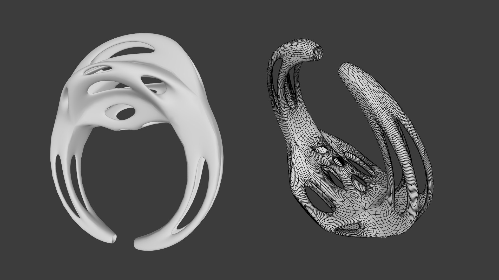

# Mesh Modifiers

## Understanding Mesh Modifiers

Mesh modifiers are powerful tools for transforming 3D meshes. They
allow you to apply various geometric operations, such as translation,
rotation, scaling, bending, and more. By understanding the core
concepts and how to use these modifiers effectively, you can create a
wide range of 3D shapes and effects.

The library offers a versatile set of pre-built modifiers, each
adhering to the `IMeshModifier` interface. If you aim to extend the
library with custom modifiers, ensuring adherence to this interface
is crucial.

```java
package mesh.modifier;

import mesh.Mesh3D;

public interface IMeshModifier {

    public Mesh3D modify(Mesh3D mesh);

}
```

**Key Point:** Returning a Modified Reference

An aspect of the `IMeshModifier` interface is that the `modify` method
returns a reference to the modified mesh.

**Applying Modifications**

You can apply modifications to a mesh in two primary ways:

**1. Direct Modification:**

```java
Mesh3D cube = new CubeCreator().create();
ScaleModifier scaleModifier = new ScaleModifier(10);
scaleModifier.modify(cube);
```

**2. Mesh-Based Application:**

```java
Mesh3D cube = new CubeCreator().create();
ScaleModifier scaleModifier = new ScaleModifier(10);
cube.apply(scaleModifier);
```

The preferred approach depends on your specific use case and coding
style. However, it's recommended to maintain consistency within your
project to enhance code readability and maintainability.

## A Practical Example: Creating a Complex Shape

To demonstrate the power of combining multiple modifiers, let's create
a complex shape:



```java
Mesh3D mesh = new CubeCreator().create();
mesh.apply(new ExtrudeModifier(0.4f, 2));
mesh.apply(new HolesModifier());
mesh.apply(new SolidifyModifier(0.2f));
mesh.apply(new ScaleModifier(1, 5, 1));
mesh.apply(new RotateZModifier(Mathf.HALF_PI));
mesh.apply(new CatmullClarkModifier(3));
mesh.apply(new BendModifier(0.2f));
```

By applying these modifiers sequentially, we can create a complex shape
that starts as a simple cube and undergoes various transformations.
This example highlights the flexibility and power of the mesh modifier
framework.

**Remember:** The order in which modifiers are applied can
significantly impact the final result. Experiment with different
sequences to achieve desired effects.

## Best Practices for Using Mesh Modifiers

* **Start with Simple Shapes:** Begin with basic shapes like cubes,
  spheres, and planes to understand the effects of different
  modifiers.
* **Combine Modifiers:** Experiment with combining multiple modifiers
  to achieve complex deformations.
* **Iterative Approach:** Apply modifiers iteratively to fine-tune the
  desired shape.
* **Consider Mesh Topology:** The topology of the mesh can
  significantly influence the results of the modification process.
* **Optimize Modifier Stacks:** For performance reasons, try to
  minimize the number of modifiers applied to a mesh.

## Basic Modifiers

* **BendModifier:** Bends the mesh along the X-axis.
* **BevelEdgesModifier:** Creates a bevel along the edges.
* **BevelFacesModifier:** Creates a bevel around faces.
* **BevelVerticesModifier:** Creates a bevel around vertices.
* **CenterAtModifier:** Centers the mesh at a specific point.
* **CrocodileModifier:** Adds spikes using the Ambo operation.
* **ExtrudeModifier:** Extrudes faces along their normals.
* **FitToAABBModifier:** Scales and translates the mesh to fit
  within an axis-aligned bounding box.
* **FlipFacesModifier:** Flips face orientation.
* **HolesModifier:** Creates holes in the mesh.
* **InsetModifier:** Insets faces inward.
* **NoiseModifier:** Adds noise to vertex positions (normals!).
* **PushPullModifier:** Pushes or pulls vertices relative to a center.
* **RandomHolesModifier:**
* **RemoveDoubleVerticesModifier:** Removes duplicate vertices.
* **RippleModifier:** Applies a sinusoidal ripple effect.
* **RotateXModifier:** Rotates around the X-axis.
* **RotateYModifier:** Rotates around the Y-axis.
* **RotateZModifier:** Rotates around the Z-axis.
* **ScaleModifier:** Scales uniformly or non-uniformly.
* **SmoothModifier:** Smoothes vertex positions.
* **SnapToGroundModifier:**
* **SolidifyModifier:** Adds thickness to faces.
* **SpherifyModifier:** Converts toward spherical shape.
* **TranslateModifier:** Translates the mesh.
* **UpdateFaceNormalsModifier:** Updates face normals.
* **WaveModifier:** Applies a wave-like deformation.
* **WireframeModifier:** Converts to wireframe.

## Subdivision Modifiers

* **CatmullClarkModifier:** Catmull-Clark subdivision.
* **DooSabinModifier:** Doo-Sabin subdivision.
* **LinearSubdivisionModifier:** Linear subdivision.
* **PlanarMidEdgeCenterModifier:** Splits edges, connects midpoints.
* **PlanarMidEdgeModifier:** Connects midpoints to centroids.
* **PlanarVertexCenterModifier:** Connects vertices to centroids.
* **PlanarVertexMidEdgeCenterModifier:** Combines all connections.
* **PokeFacesModifier:** Adds center vertex to each face.
* **QuadsToTrianglesModifier:** Converts quads to triangles.

## Bend Modifier

**Purpose:**

The Bend Modifier deforms a mesh by bending it along the X-axis.

**How it works:**

**Bending Factor:**

The `factor` parameter controls bend intensity.

**Vertex Deformation:**

* For each vertex:
* X is used to compute an angle.
* Y and Z are adjusted based on angle and factor.

**Using the Bend Modifier:**

1. Create a mesh.
2. Create a BendModifier.
3. Apply it.

```java
GridCreator creator = new GridCreator();
creator.setSubdivisionsX(10);
creator.setSubdivisionsZ(10);
creator.setTileSizeX(1);
creator.setTileSizeZ(1);

Mesh3D mesh = creator.create();
BendModifier modifier = new BendModifier(0.5f);

mesh.apply(modifier);
```

**Additional Considerations:**

* High factors may cause distortion.
* Topology affects results.
* Can be combined with other modifiers.

## Noise Modifier

**Purpose:**

Adds random variation to vertex positions.

**How it Works:**

1. Generate random values.
2. Multiply by vertex normals.
3. Offset positions.

**Using the Noise Modifier:**

```java
Mesh3D mesh = new CubeCreator().create();
NoiseModifier noiseModifier = new NoiseModifier(-0.1f, 0.1f);
noiseModifier.setSeed(1234);
mesh.apply(noiseModifier);
```

**Additional Considerations:**

* Controls: `minimum`, `maximum`, `seed`.
* Works best with good topology.
* Combines well with other modifiers.

## Push-Pull Modifier

**Purpose:**

Pushes or pulls vertices relative to a center point.

**How it works:**

1. Define center.
2. Use `distance`.
3. Move vertices along direction vector.

**Example:**

```java
// TODO
```

## Random Holes Modifier

**Purpose:**

Creates holes by scaling faces inward randomly.

**How it works:**

1. Random scale per face.
2. Apply extrusion inward.
3. Creates holes.

```java
Mesh3D mesh = new CubeCreator().create();
RandomHolesModifier modifier =
    new RandomHolesModifier(0.2f, 0.8f);

modifier.setSeed(1234);
modifier.modify(mesh);
```

## Snap to Ground Modifier

**Purpose:**

Aligns lowest point to ground level.

**How it works:**

1. Find lowest Y.
2. Compute offset.
3. Translate mesh.

```java
Mesh3D cube = new CubeCreator().create();
cube.apply(new TranslateModifier(0, 10, 0));

SnapToGroundModifier modifier =
    new SnapToGroundModifier(0);

modifier.modify(cube);
```

## Translate Modifier

**Purpose:**

Shifts all vertices by a vector.

```java
Mesh3D mesh = new CubeCreator().create();

TranslateModifier translateModifier =
    new TranslateModifier(2, 1, -3);

mesh.apply(translateModifier);
```

## RotateXModifier

**Purpose:**

Rotates a mesh around the X-axis.

```java
Mesh3D mesh = new CubeCreator().create();

RotateXModifier rotator =
    new RotateXModifier(Mathf.QUATER_PI);

mesh.apply(rotator);
```