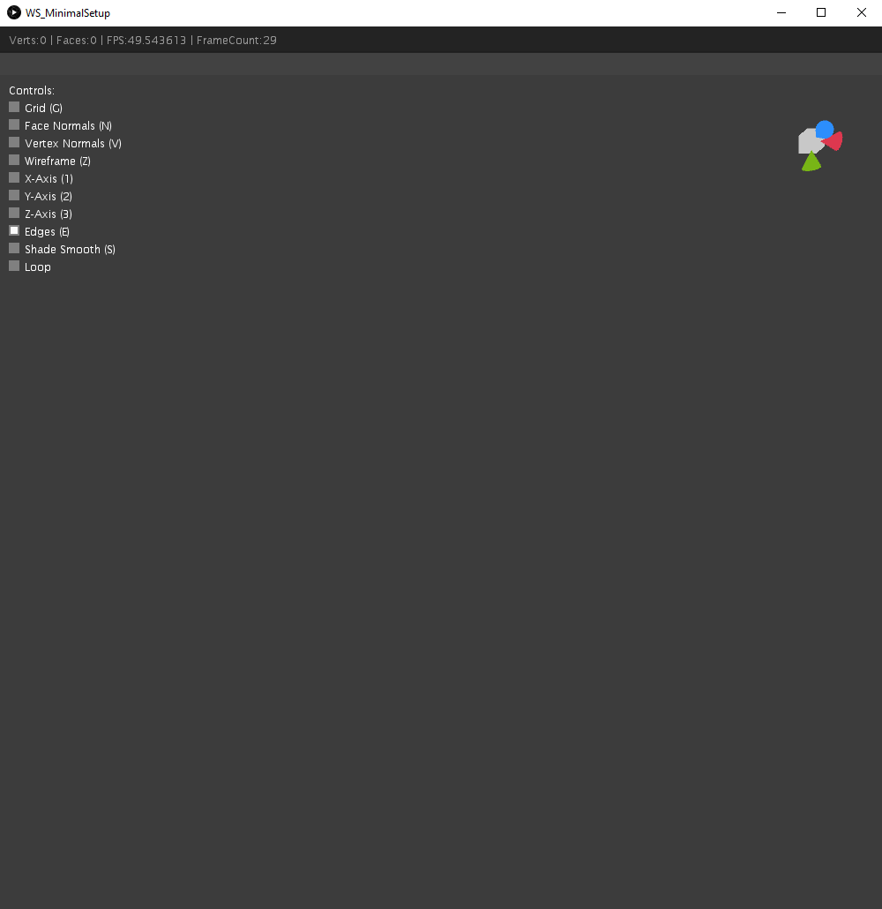
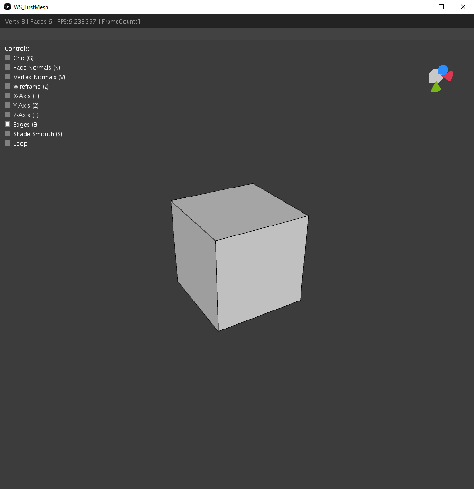

# The Workspace: A Minimal 3D Mesh Viewer

The Workspace is a streamlined tool designed for visualizing and inspecting 3D models. It's tightly integrated
with the Processing environment, leveraging its powerful rendering capabilities. While it doesn't aspire
to be a comprehensive 3D modeling suite, it provides essential features for working with mesh data.

**Note:** All provided examples are located in the **src/main/java/workspace/examples** folder (package).

## Getting Started
To use the Workspace, simply create an instance and provide a reference to your Processing
sketch (PApplet). No immediate interaction with the Workspace is necessary in the draw() method.
The Workspace is ready to use with its default functionalities.

```java
package workspace.examples;

import processing.core.PApplet;
import workspace.Workspace;

public class WS_MinimalSetup extends PApplet {

	public static void main(String[] args) {
		PApplet.main(WS_MinimalSetup.class.getName());
	}

	private Workspace workspace;

	@Override
	public void settings() {
		size(1000, 1000, P3D);
	}

	@Override
	public void setup() {
		workspace = new Workspace(this);
	}

	@Override
	public void draw() {

	}

}
```



### Key Features

**Camera Control**

* **Zoom:** Scroll the mouse wheel.
* **Rotate:** Drag with the middle mouse button.
* **Pan:** Drag with the middle mouse button while holding Shift.
* **First-Person Navigation:** Use WASD keys.

**Scene Manipulation**
  
* **Reset Camera:** Press C.
* **Toggle UI:** Press Y.
* **Toggle Grid:** Press G.
* **Show/Hide Normals:** Press N for face normals, V for vertex normals.
* **Wireframe/Solid View:** Press Z.
* **Show/Hide Axes:** Press 1, 2, or 3.
* **Show/Hide Edges:** Press E.
* **Smooth/Flat Shading:** Press S.
* **First-Person Mode:** Press 4.
* **Toggle Rendering Loop:** Use the UI control.

## Displaying Your First Mesh

A blank workspace can be a bit dull, don't you think? Let's add a simple mesh to our example and display it in the workspace.



```java
package workspace.examples;

import mesh.Mesh3D;
import mesh.creator.primitives.CubeCreator;
import processing.core.PApplet;
import workspace.Workspace;

public class WS_FirstMesh extends PApplet {

    public static void main(String[] args) {
        PApplet.main(WS_FirstMesh.class.getName());
    }

    private Mesh3D mesh;
    private Workspace workspace;

    @Override
    public void settings() {
        size(1000, 1000, P3D);
    }

    @Override
    public void setup() {
        workspace = new Workspace(this);
        mesh = new CubeCreator().create();
    }

    @Override
    public void draw() {
        workspace.draw(mesh);
    }

}
```

This provided code creates a simple cube and displays it in the workspace. 
The workspace.draw(mesh) line is responsible for rendering the mesh.

**Let's break down the code:**

**Creating a Workspace:**

```workspace = new Workspace(this);``` creates a new Workspace instance, linking it to the current PApplet.

**Creating a Cube Mesh:**

```mesh = new CubeCreator().create();``` creates a new Cube mesh using the CubeCreator class.

**Drawing the Mesh:**

```workspace.draw(mesh);``` renders the mesh object within the workspace.

## Workspace Settings

By default, the Workspace UI with its control options is visible. However, you can toggle its visibility both
during runtime (using the 'Y' key) and beforehand. To disable the UI from the start, use the ```setUiVisible(false)``` method:

```java
package workspace.examples;

import mesh.Mesh3D;
import mesh.creator.primitives.CubeCreator;
import processing.core.PApplet;
import workspace.Workspace;

public class WS_WorkspaceSettings extends PApplet {

    public static void main(String[] args) {
        PApplet.main(WS_WorkspaceSettings.class.getName());
    }

    private Mesh3D mesh;
    private Workspace workspace;

    @Override
    public void settings() {
        size(1000, 1000, P3D);
    }

    @Override
    public void setup() {
        workspace = new Workspace(this);
        workspace.setUiVisible(false); // Hide the UI
        mesh = new CubeCreator().create();
    }

    @Override
    public void draw() {
        workspace.draw(mesh);
    }

}
```

## Let's create something more complex!

To demonstrate the versatile capabilities of our library, let's expand on our simple cube example. 
By combining basic shapes and various modifiers, we can quickly create intricate geometries.

**The basic concept:**

We start with a fundamental shape, like a cube. Then, we sequentially apply different modifiers. 
These modifiers perform operations such as bevel vertices, punching holes, subdividing the mesh, or adding thickness.

**A concrete example:**

```java
package workspace.examples;

import mesh.Mesh3D;
import mesh.creator.primitives.CubeCreator;
import mesh.modifier.BevelVerticesModifier;
import mesh.modifier.HolesModifier;
import mesh.modifier.SolidifyModifier;
import mesh.modifier.subdivision.PlanarMidEdgeCenterModifier;
import mesh.modifier.subdivision.PlanarVertexCenterModifier;
import processing.core.PApplet;
import workspace.Workspace;

public class WS_FirstMeshModification extends PApplet {

    public static void main(String[] args) {
        PApplet.main(WS_FirstMeshModification.class.getName());
    }

    private Mesh3D mesh;
    private Workspace workspace;

    @Override
    public void settings() {
        size(1000, 1000, P3D);
        smooth(8);
    }

    @Override
    public void setup() {
        workspace = new Workspace(this);
	
        // Start with a simple cube
        mesh = new CubeCreator().create();

        // Apply various modifiers
        mesh.apply(new BevelVerticesModifier(0.2f)); // Bevel edges
        mesh.apply(new PlanarMidEdgeCenterModifier()); // Subdivides the mesh
        mesh.apply(new PlanarVertexCenterModifier()); // Adds more subdivisions
        mesh.apply(new HolesModifier(0.6f)); // Punches holes
        mesh.apply(new SolidifyModifier(0.04f)); // Adds thickness
    }

    @Override
    public void draw() {
        workspace.draw(mesh);
    }
}
```

**What happens here:**

By combining these modifiers, we transform a simple cube into a more complex shape with
rounded edges, holes, and depth. This example showcases the library's flexibility and 
the ease of creating intricate geometries.

**Experiment yourself!**

Try different combinations of modifiers and adjust the parameters to create your own unique shapes.
